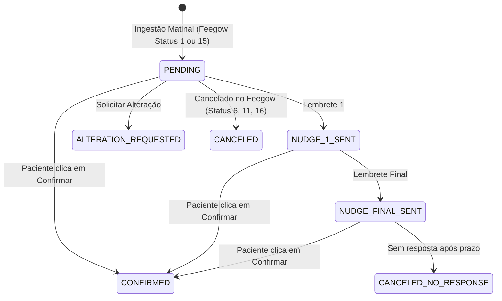

# Catálogo de Funcionalidades e Regras de Negócio — Inovare TI

Este documento especifica formalmente as regras de negócio, algoritmos de automação, fluxos de contingência e diretrizes operacionais de cada módulo do ecossistema Inovare TI.

---

## 1. Motor de Agendamentos e WhatsApp

O motor de agendamentos automatiza a confirmação, o cancelamento, a alteração e o acompanhamento pós-consulta de pacientes da Clínica Inovare integrando o Feegow ERP ao WhatsApp (via Take Blip).

### 1.1 Ingestão e Calendário de Antecedência (D+0 a D+3)
A rotina matinal de ingestão (`IngestAppointmentsUseCase`) é executada automaticamente e segue regras de cálculo de dias de antecedência:
* **Operação em Dias Úteis:** O motor opera de segunda a sexta-feira. Aos sábados e domingos a ingestão geral é ignorada.
* **Segunda a Quinta-Feira:** Consulta os agendamentos de **Hoje (D+0)** e **Amanhã (D+1)**.
* **Sexta-Feira:** Consulta os agendamentos de **Sexta (D+0)**, **Sábado (D+1)** e antecipa as consultas de **Segunda-Feira (D+3)**.
* **Regra D+2 para Médicos com Antecedência Configurada:**
  * Médicos configurados com `advance_notice_days = 2` na tabela `doctor_configurations` (ex: Dr. Giuliano) recebem buscas dedicadas para D+2.
  * **Trava D+2:** As buscas D+2 são executadas exclusivamente às **quartas-feiras** (para pautas de sexta D+2) e às **quintas-feiras** (para pautas de sábado D+2).

### 1.2 Filtro Estrito de Procedimentos (Cirurgias vs Consultas)
Para garantir que procedimentos cirúrgicos complexos não recebam mensagens automáticas indevidas:
* **Bloqueio Cirúrgico:** Qualquer procedimento que contenha a raiz `"cirurg"`, `"cirurgias mu"`, `"cirurgias mar"`, `"cirurgia dr"` é sumariamente descartado da esteira.
* **Exceções Cirúrgicas Permitidas:** Termos explícitos como `"conversar cirurgia"`, `"acertar cirurgia"` e `"retorno"` são aceitos.
* **Procedimentos Ambulatoriais Permitidos:** Consultas, retornos, exames, curativos, avaliações, retirada de pontos/dreno, botox, lobuloplastia, laser CO2, infiltrações, viscossuplementação, bioestimuladores e biópsias são elegíveis.

### 1.3 Máquina de Estados e Blindagem Anti-Cancelamento
As sessões de agendamento seguem o ciclo de vida gerenciado por `ConfirmationStateMachineService`:

* **Blindagem de Sessões Confirmadas:** Registros com status local `CONFIRMED` **nunca** são cancelados automaticamente na ingestão matinal.
* **Reconciliação Preventiva:** Se um agendamento deixar de vir na busca geral de `StatusID = 1`, o sistema consulta o status individual na API do Feegow antes de qualquer alteração:
  * Se o status retornado for de confirmação/presença (`7, 2, 3, 4, 5, 101, 103, 105`), atualiza/mantém como `CONFIRMED`.
  * Se o status for cancelamento explícito (`6` Falta, `11` Desmarcado pelo paciente, `16` Desmarcado pelo profissional), atualiza para `CANCELED`.

### 1.4 Esteira de Lembretes Recorrentes (Nudges)
* **Nudges Individuais e de Grupo:** Gerenciados pelo `MonitorAppointmentNudgesUseCase`. Se o paciente não responder ao primeiro template de aviso, o sistema agenda disparos de reforço.
* **Re-validação Preventiva:** Antes de enviar cada nudge, o sistema consulta a API do Feegow. Se a consulta tiver sido cancelada, remarcada ou confirmada na recepção, o envio é abortado imediatamente.
* **Attendance Guard:** Se houver um ticket de atendimento humano ativo no Blip Desk para o paciente (`hasActiveTicket`), o envio de nudges é pausado para não interromper a conversa com a secretária.

### 1.5 Avaliação Pós-Consulta (Google Review)
* O serviço `SendPostAppointmentReviewUseCase` roda periodicamente consultando agendamentos do dia no Feegow com status `StatusID = 3` (*Atendido*).
* Para cada paciente atendido cujo médico possua uma URL configurada em `doctor_configurations.google_review_url`, o sistema despacha uma mensagem convidando o paciente a avaliar o atendimento no Google Meu Negócio.

### 1.6 Monetização Médica e Licenciamento
* O motor valida a assinatura do profissional (`DoctorBilling/isLicensed`) antes de processar os agendamentos. Pautas de médicos inativos ou suspensos são ignoradas na ingestão.

---

## 2. Controle de Acesso Físico e Catracas (Módulo Access)

O módulo `access` integra a confirmação de consultas do Feegow ao sistema de controle de catracas físicas **GerAcesso**.

### 2.1 Janela Dinâmica de Acesso Físico
Para garantir a segurança predial e a comodidade dos pacientes:
* **Horário de Abertura:** A credencial/QR Code é liberado exatamente **2 horas antes** do horário agendado da consulta.
* **Horário de Encerramento:** A validade estende-se até as **21:00 do mesmo dia**, cobrindo possíveis atrasos em consultas do período da tarde/noite.
* **Agrupamento Familiar:** Pacientes com múltiplos agendamentos no mesmo dia têm sua janela calculada a partir da primeira consulta do dia.

### 2.2 Cadastro Concorrente de Acompanhantes (Java 21 Virtual Threads)
* O paciente titular pode informar múltiplos acompanhantes pelo chatbot do Blip.
* O backend dispara as requisições de cadastro de cada acompanhante para a API do GerAcesso em **paralelo** utilizando **Virtual Threads** (`Executors.newVirtualThreadPerTaskExecutor()`).
* **Resiliência Fail-Safe:** Cada acompanhante é processado em bloco isolado com `try-catch`. A eventual falha no cadastro de um acompanhante não interrompe nem invalida a liberação do titular e dos demais acompanhantes.

### 2.3 Fallback Síncrono de CPF no WhatsApp
* Se o CPF do paciente não estiver registrado no prontuário do Feegow nem for enviado pelo payload, o endpoint `/api/v1/access/blip/confirmation` retorna imediatamente `"requiresCpfFallback": true`. O bot do Blip direciona o usuário para o bloco de digitação do CPF antes de liberar a credencial da catraca.

---

## 3. Central de Chamados de Suporte (ITSM)

### 3.1 Cálculo de SLA Útil e Priorização Dinâmica
* O prazo limite de resolução (`sla_deadline`) é calculado somando a quantidade de horas da categoria (`itsm_categories.sla_hours`) considerando **apenas o horário comercial útil** da clínica.
* Finais de semana e noites não consomem o tempo de SLA.

### 3.2 Regra de Parada Crítica (#🚨ParadaCrítica)
Quando um incidente impede o funcionamento de consultórios, exames ou sistemas centrais:
* **Disparo:** Chamado vinculado a ativo crítico (`assets.is_critical = true`) ou com código patrimonial (`INV-\d{4}-\d+`) na descrição.
* **Ações Automáticas:**
  1. A prioridade é promovida para `URGENT`.
  2. O SLA é recalculado para o prazo estrito de **1 hora**.
  3. A tag `#🚨ParadaCrítica` é vinculada ao chamado.
  4. Alerta com embed vermelho e localização física é enviado por DM do Discord aos técnicos e ao canal operacional.

### 3.3 Subchamados e Múltiplas Atribuições
* **Hierarquia (`parent_ticket_id`):** Incidentes complexos podem ser divididos em subchamados menores atribuídos a diferentes especialistas.
* **Atribuições Múltiplas (`ticket_assignments`):** Permite que mais de um técnico atue simultaneamente na resolução do chamado.

---

## 4. Gestão de Ativos e Estoque (CMDB + FIFO)

### 4.1 Dedução de Estoque via Algoritmo FIFO (First-In, First-Out)
* A saída de insumos de TI consome prioritariamente os lotes mais antigos (`stock_batches`) com saldo positivo (`remaining_quantity > 0`).
* **Transacionalidade Obrigatória:** A dedução de estoque ocorre dentro da mesma transação do chamado (`Propagation.MANDATORY`). Se o saldo for insuficiente, a transação inteira sofre rollback.

### 4.2 Alertas de Estoque Mínimo (`min_stock`)
* Quando a retirada faz o saldo total do item atingir ou ficar abaixo de `min_stock`, o evento `LowStockEvent` dispara uma notificação imediata no canal de compras do Discord.

### 4.3 Rastreabilidade Bidirecional de Manutenções (CMDB + ITSM)
* Ordens de serviço registradas em `asset_maintenances` vinculam o ID do chamado de suporte de origem (`ticket_id`), permitindo auditoria contábil dos custos de reparo de cada equipamento.

---

## 5. Cofre de Senhas (Vault) & Auditoria LGPD

### 5.1 Criptografia Simétrica AES-256-GCM e MFA Mandatório
* Dados confidenciais e anexos são cifrados com **AES-256-GCM** com IV aleatório e autenticação de integridade.
* A visualização ou alteração de qualquer segredo exige validação prévia de segundo fator TOTP (claim `two_factor_verified = true`).

### 5.2 Trilha de Auditoria Imutável (`audit_logs`)
* Todas as ações sensíveis (acesso ao cofre, alterações de chamado, liberações de catraca, logins) publicam eventos assíncronos (`AuditEvent`) gravados com IP, data e correlation ID.