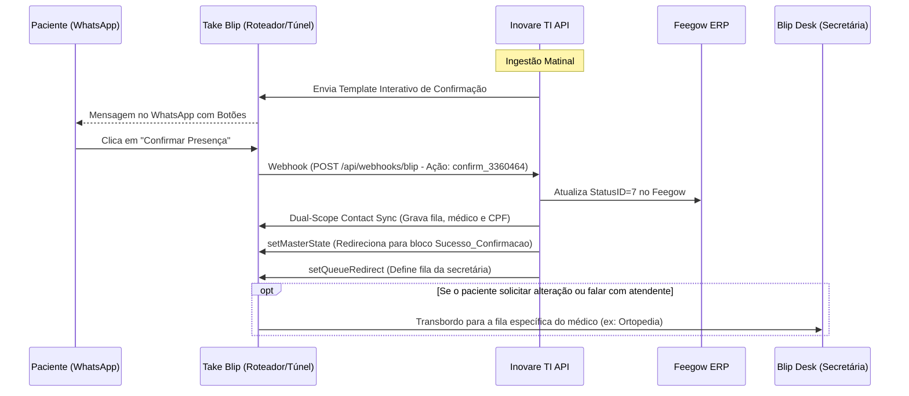

# Manual de Integrações e APIs Externas — Inovare TI

Este documento apresenta os contratos de integração, diagramas de sequência, payloads JSON e fluxos de contingência entre o ecossistema Inovare TI e as plataformas externas parceiras: **Feegow ERP**, **Take Blip (WhatsApp)**, **GerAcesso (Catracas)**, **Conta Azul V2 (Financeiro)** e **Discord (Bot JDA 5)**.

---

## 1. Integração com Feegow ERP (Prontuário & Pautas)

O Feegow ERP é o sistema central de prontuários médicos da clínica. A comunicação é realizada via chamadas HTTPS autenticadas pelo header `x-access-token`.

### 1.1 Tabela Oficial de Status de Agendamento do Feegow

| ID | Status Oficial | Classificação Inovare | Comportamento no Sistema |
|:---:|:---|:---:|:---|
| **`1`** | **Marcado - não confirmado** | `PENDING` | Elegível para disparo inicial de confirmação e lembretes (nudges). |
| **`7`** | **Marcado - confirmado** | `CONFIRMED` | Confirmado: Preservado, nunca cancelado e sem cobrança de lembrete. |
| **`15`** | **Remarcado** | `PENDING` | Elegível para nova confirmação de data. |
| **`2`** | **Em atendimento** | `CONFIRMED` / Presença | Paciente em consultório. Não cancela / Aborta lembrete. |
| **`3`** | **Atendido** | `CONFIRMED` / Presença | Consulta concluída. Dispara avaliação Google Review pós-atendimento. |
| **`4`** | **Aguardando \| Atendimento** | `CONFIRMED` / Presença | Paciente presente na recepção. Não cancela / Aborta lembrete. |
| **`5`** | **Chamando \| atendimento** | `CONFIRMED` / Presença | Paciente chamado no painel. Não cancela / Aborta lembrete. |
| **`101`** | **Aguardando \| Triagem** | `CONFIRMED` / Presença | Paciente na triagem. Não cancela / Aborta lembrete. |
| **`103`** | **Em atendimento \| Triagem** | `CONFIRMED` / Presença | Paciente em triagem. Não cancela / Aborta lembrete. |
| **`105`** | **Chamando \| Triagem** | `CONFIRMED` / Presença | Paciente sendo chamado para triagem. Não cancela / Aborta lembrete. |
| **`6`** | **Não compareceu** | `CANCELED` (Falta) | Sessão local encerrada como cancelada / Bloqueio de lembretes. |
| **`11`** | **Desmarcado pelo paciente** | `CANCELED` | Sessão local encerrada como cancelada / Bloqueio de lembretes. |
| **`16`** | **Desmarcado pelo profissional** | `CANCELED` | Sessão local encerrada como cancelada / Bloqueio de lembretes. |

### 1.2 Principais Endpoints Consumidos

* **Busca de Agendamentos por Data e Status:**
  ```http
  GET https://api.feegow.com/v1/api/appoints/search?data={YYYY-MM-DD}&status=1&id_profissional={id}
  x-access-token: {{FEEGOW_TOKEN}}
  ```
* **Busca de Agendamento Individual por ID:**
  ```http
  GET https://api.feegow.com/v1/api/appoints/search?agendamento_id={id}
  x-access-token: {{FEEGOW_TOKEN}}
  ```
* **Atualização de Status de Consulta:**
  ```http
  POST https://api.feegow.com/v1/api/appoints/statusUpdate
  Content-Type: application/json
  x-access-token: {{FEEGOW_TOKEN}}

  {
    "AgendamentoID": 3360464,
    "StatusID": 7,
    "Obs": ""
  }
  ```
* **FEEGOW-STATUS-GUARD:** O adaptador impede regressão indevida para status 7 caso o paciente já esteja em estado avançado (`2, 3, 4, 5, 6, 7, 11, 16, 101, 103, 105`).
* **Preservação de Agenda em Cancelamentos:** Ao receber intenção de cancelamento pelo WhatsApp, a API **não chama `/appointment/cancel`**. A consulta permanece intacta na grade da clínica e a conversa é roteada para a recepção no Blip Desk para remanejamento manual seguro.

---

## 2. Integração com Take Blip (WhatsApp Cloud & Blip Desk)

A integração com o Take Blip utiliza a API Active Campaign (`/campaign/full`), comandos LIME e webhooks para automação e transbordo para secretárias.

### 2.0 Suporte a Templates Estáticos (0 Parâmetros - WhatsApp Meta)
* Templates sem variáveis no corpo (ex: `aviso_agendamento_grupo`) são identificados por `isStaticZeroParamTemplate`.
* O backend **omite totalmente o array `messageParams`** no JSON enviado para a Take Blip, cumprindo a validação da Meta e prevenindo erros `Code 81 - #132000`.



### 2.1 Sincronização de Contatos em Duplo Escopo (Dual-Scope Sync)
Para garantir que os dados do paciente e o roteamento de fila estejam disponíveis tanto no bot principal quanto no painel de atendimento humano:
* O serviço `BlipContactClientAdapter` envia o comando LIME `/contacts` de forma síncrona para:
  1. **Roteador Principal:** Utilizando a chave `APP_APPOINTMENT_BLIP_BOT_KEY`.
  2. **Túnel do Blip Desk:** Utilizando a chave `APP_APPOINTMENT_BLIP_DESK_KEY`.
* **Metadados Gravados em `extras`:**
  * `Medico`: Nome do profissional atendente.
  * `fila`: Nome textual sanitizado da fila de destino (ex: `Ortopedia Pediátrica - Dr. Eduardo Mattos`, `Cirurgia Vascular - Dr. Bruno Figueiredo Pançan`).
  * `taxDocument`: CPF formatado do titular.
  * `birthDate`: Data de nascimento do prontuário.

### 2.2 Transbordo Dinâmico por Fila no Blip Desk
* O resolvedor de filas (`BlipContextService.resolveQueueName`) traduz o UUID ou ID do médico para o nome exato da fila cadastrada no Blip Desk.
* O comando `setQueueRedirect` injeta a variável de contexto `attendanceQueueToRedirect` no contato. No fluxo do Blip, o bloco de transbordo humano lê `{{contact.extras.fila}}` para direcionar a conversa à secretária responsável.

---

## 3. Integração com Controle de Catracas Físicas (GerAcesso)

O módulo `access` orquestra a emissão de credenciais físicas e QR Codes para entrada na clínica.

### 3.1 Contrato REST da API GerAcesso

* **Endpoint:** `POST http://172.25.100.106:8082/AgendamentoVisita`
* **Autenticação:** `Authorization: Bearer {{INOVARE_GERACESSO_TOKEN}}`
* **Payload de Cadastro:**
  ```json
  {
    "documento": "12251091831",
    "nome": "SILVANA CRISTINA CARDOSO",
    "tipo": 1,
    "inicioValidade": "2026-08-24T08:00:00",
    "fimValidade": "2026-08-24T21:00:00",
    "observacao": "Agendamento Feegow 3366065"
  }
  ```
* **Campos Retornados:**
  * `localizador`: Código alfanumérico único (ex: `LOC-849201`).
  * `codigoCredencial`: Código numérico lido pelo leitor da catraca ou convertido em QR Code.

### 3.2 Cadastro Concorrente de Acompanhantes
* Acompanhantes enviados no payload de confirmação são disparados para o GerAcesso em **paralelo** via **Java 21 Virtual Threads**.
* Em caso de indisponibilidade no cadastro de um acompanhante secundário, o titular e os outros acompanhantes são mantidos e liberados normalmente.

---

## 4. Integração Financeira (Conta Azul V2)

Automação de conciliação de faturamentos quitados (`ACQUITTED`) e emissão de recibos fiscais.

### 4.1 Ciclo de Vida OAuth2 e Renovação Proativa
* **Fluxo de Autorização:** Consentimento via URL gerada com `client_id`, `redirect_uri` e `state` UUID.
* **Troca de Authorization Code:** Troca síncrona no endpoint `/callback`, gravando `access_token` e `refresh_token` na tabela `contaazul_oauth_tokens`.
* **Proatividade e Concorrência:** Um job periódico a cada 50 minutos valida se a expiração está a menos de 5 minutos. Uma trava `ReentrantLock` impede que múltiplas threads disparem renovações duplicadas.
* **Purga Automática:** Se a API retornar `invalid_grant`, todos os tokens locais são purgados e o painel exibe aviso para nova autorização manual.

### 4.2 Rate Limiting e Pacing
* **Rate Limiting Distribuído:** O endpoint `/force-refresh` é protegido pelo `RedisRateLimiter` (limite de 3 requisições por minuto por usuário/IP), com fallback síncrono em memória (`ConcurrentHashMap`).
* **Pacing no Loop de Vendas:** Pausa controlada de **350ms** (`LockSupport.parkNanos`) entre cada venda processada.
* **Emissão de Contingência (OpenPDF):** Se o download do recibo oficial falhar, o serviço `InternalReceiptEmissionService` gera um PDF interno padronizado com layout corporativo Inovare.

---

## 5. Integração com Discord (Bot JDA 5)

Roteamento de incidentes e operações de suporte em tempo real.

### 5.1 Slash Commands Administrativos
* `/ti status`: Exibe embed rico com status da JVM, memória, banco de dados, filas e conexões de rede. Restrito aos IDs de administradores configurados em `discord.bot.admin-ids`.
* `/solicitar`: Interface para colaboradores solicitarem insumos de hardware com autocomplete em tempo real.

### 5.2 Botões Interativos de Ação em Chamados
* As mensagens de novos chamados enviadas aos técnicos incluem botões interativos:
  * `ticket_accept:{ticketId}`: Atribui o chamado ao técnico no banco de dados e atualiza a mensagem no Discord com rodapé confirmatório.
  * `ticket_reject:{ticketId}`: Libera o chamado para os demais técnicos.
* **Virtual Threads:** Todas as interações do bot são executadas sob o `discordExecutor` para não bloquear a thread de heartbeat do WebSocket do Discord.
