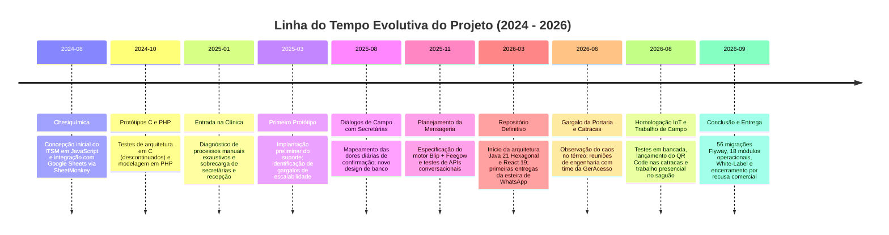
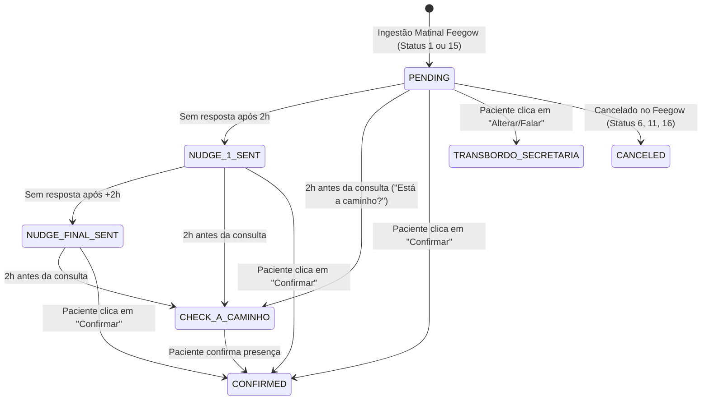
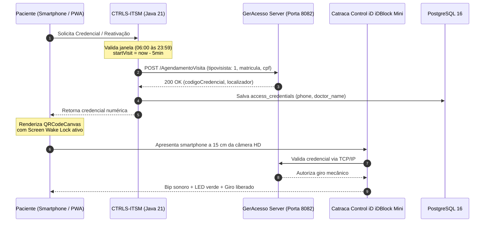

# Arquitetura e Implementação de um Ecossistema Hospitalar Integrado: ITSM, Automação Omnichannel, Conciliação Fiscal e Controle de Acesso IoT

**Documento:** Memorial Técnico-Descritivo, Relatório de Engenharia e Post-Mortem de Projeto  
**Autor:** Victor Gabriel Hass  
**Finalidade:** Trabalho de Conclusão de Curso (TCC) / Portfólio de Engenharia de Software  
**Período de Concepção e Desenvolvimento:** Agosto de 2024 a Setembro de 2026  
**Stack Principal:** Java 21 (Loom / Virtual Threads), Spring Boot 3 (Arquitetura Hexagonal), PostgreSQL 16, Redis, React 19, TypeScript, Vite, TailwindCSS, Docker, Take Blip (LIME Protocol), Feegow ERP API, Conta Azul V2 API, Control iD iDBlock Mini (GerAcesso), Discord JDA 5.  
**Situação Operacional:** Projeto concluído em nível de produção e descontinuado unilateralmente por recusa comercial de custeio por parte da instituição de saúde contratante.

---

## 1. Visão Geral e Pilares da Solução

Este memorial técnico documenta a concepção, o desenvolvimento em nível de produção e o encerramento do ecossistema hospitalar integrado **CTRLS-ITSM**, idealizado e desenvolvido por iniciativa direta do autor como uma solução sob medida para automatizar de ponta a ponta os fluxos operacionais de uma policlínica médica de grande porte e de seu centro parceiro de diagnóstico por imagem (**Clínica da Imagem**).

A solução unificou 5 frentes críticas de operação médica e predial:
1. **Comunicação Omnichannel e Automação de Agendamentos:** Esteira inteligente conectando o WhatsApp (via Take Blip e Meta WhatsApp Cloud API) à grade médica do **Feegow ERP**, eliminando o trabalho braçal das secretárias, tratando particularidades de cada agenda médica e reduzindo comprovadamente o absenteísmo (*no-show*).
2. **Controle de Acesso Físico IoT:** Integração direta com catracas eletrônicas **Control iD iDBlock Mini** e software de portaria **GerAcesso** na rede local, emitindo QR Codes dinâmicos em Progressive Web App (PWA) e eliminando as filas e cadastros manuais na recepção do térreo.
3. **Marketing de Reputação:** Algoritmo automatizado de escuta pós-consulta que identifica pacientes atendidos no Feegow e despacha links de avaliação 5 estrelas no Google Meu Negócio, direcionando para a página individual do médico ou para a página institucional da clínica.
4. **Conciliação Financeira:** Automação de baixas de honorários e emissão de recibos médicos via **Conta Azul V2 API**.
5. **ITSM e Governança de TI:** Gestão de incidentes com cálculo de SLA em horas úteis, inventário patrimonial com baixa FIFO e bot operacional no Discord (JDA 5).

---

## 2. Histórico Evolutivo e Cronologia da Engenharia (2024 – 2026)

A construção do ecossistema resultou de uma maturação contínua de mais de dois anos dividida em marcos fundamentais:



### 2.1 Fase Embrionária (Agosto de 2024 a Dezembro de 2024 — Chesiquímica)
O embrião do módulo de suporte técnico iniciou em agosto de 2024 na indústria Chesiquímica. O objetivo era substituir formulários impressos por uma solução ágil de chamados de manutenção. A primeira versão foi construída em JavaScript conectada a planilhas Google Docs por meio da API SheetMonkey. 

Buscando maior performance e controle de memória, foram realizados experimentos em linguagem C e posteriormente em PHP. Essa fase permitiu mapear os requisitos de governança, ciclo de vida de chamados e controle de insumos.

### 2.2 Diagnóstico e Concepção na Clínica (Janeiro de 2025 a Novembro de 2025)
Ao assumir a infraestrutura tecnológica da instituição médica em janeiro de 2025, constatou-se a ausência de sistemas integrados de TI: computadores de consultório operavam sem inventário formal, filas de espera na recepção do térreo acumulavam dezenas de pacientes sem credencial predial e o índice de faltas em consultas era alarmante.

Em março de 2025 foi desenvolvido um protótipo inicial para atendimento de chamados de TI. Paralelamente, através da observação atenta do cotidiano da clínica, o autor identificou as duas maiores fontes de ineficiência operacional humana:
1. As secretárias médicas passavam horas diárias ao telefone e trocando mensagens manuais individuais no WhatsApp para confirmar presenças;
2. As recepcionistas do térreo sofriam com sobrecarga severa, tendo que atender ligações, responder WhatsApp geral da clínica e realizar cadastros manuais de crachás físicos para as catracas.

O projeto foi reestruturado a partir de agosto de 2025 com modelagem relacional rigorosa e planejamento da orquestração de mensagens via Take Blip e Feegow ERP.

### 2.3 Desenvolvimento e Implantação do Ecossistema Final (Março de 2026 a Setembro de 2026)
Em março de 2026 foi iniciado o repositório definitivo. Optou-se pela **Arquitetura Hexagonal (Ports & Adapters)** em **Java 21**, aproveitando o suporte nativo a **Virtual Threads (Project Loom)** para suportar centenas de requisições I/O concorrentes sem gargalos de thread pool. O frontend foi construído em **React 19 / TypeScript** com empacotamento otimizado via Vite.

Ao longo de 7 meses ininterruptos, o autor implementou **56 migrações Flyway**, 18 contextos delimitados desacoplados, a integração de hardware físico IoT com reuniões com a fabricante GerAcesso, trabalho presencial de UX no saguão da clínica e o algoritmo proprietário de reputação no Google.

---

## 3. Topologia Arquitetural e Visão dos Módulos

O backend foi arquitetado sob princípios rígidos de isolamento de domínio corporativo, garantindo que mudanças em APIs externas (Feegow, Meta/Blip, Conta Azul ou GerAcesso) afetem estritamente a camada de adaptadores de infraestrutura (`infrastructure.adapter.output`), mantendo as regras de negócio (`domain`) e de aplicação (`application.usecase`) imutáveis e auditáveis:

```
br.dev.ctrls.itsm.modules/
├── access/         <-- Catracas físicas Control iD, QR Codes dinâmicos, PWA e acompanhantes
├── appointment/    <-- Ingestão Feegow, esteira de confirmações, nudges 2h e Google Review
├── finance/        <-- Conta Azul V2, conciliação de baixas e recibos OpenPDF
├── notification/   <-- Bot Discord JDA 5, Slash Commands e incidentes de TI
├── ticket/         <-- Central ITSM, cálculo de SLA em horas úteis e regra #🚨ParadaCrítica
├── asset/          <-- Inventário CMDB e rastreabilidade patrimonial
├── inventory/      <-- Estoque de insumos de informática e algoritmo FIFO
├── vault/          <-- Cofre criptográfico AES-256-GCM e autenticação TOTP/2FA
├── audit/          <-- Trilha de conformidade LGPD imutável com Correlation IDs
├── settings/       <-- Parâmetros do sistema e motor White-Label dinâmico (V56)
├── user/           <-- RBAC, hierarquia de setores e segurança
└── ...             <-- Módulos de apoio: auth, analytics, communication, etc.
```

---

## 4. Desafios Técnicos de Engenharia, Decisões e Soluções de Campo

### 4.1 Automação Omnichannel e Mensageria (Take Blip & Feegow ERP)

#### A Gênese do Sistema de Confirmações e a Discrepância Comercial do Mercado:
O sistema de confirmações automáticas nasceu de uma iniciativa pessoal e proativa do autor. Ao acompanhar a rotina dos consultórios, era evidente o desperdício de tempo e energia das secretárias médicas: passavam a maior parte do expediente ligando individualmente para dezenas de pacientes e enviando mensagens manuais repetitivas para confirmar pautas do dia seguinte. Se uma secretária atendia dois ou três médicos de alta rotatividade, sua capacidade de prestar atendimento humanizado presencial aos pacientes nos consultórios era completamente sufocada.

Anteriormente, a clínica já havia chegado a orçar com a própria Take Blip o desenvolvimento de um bot para essa finalidade. A cotação oficial apresentada pela empresa cobrava valores exorbitantes para entregar um fluxo básico e engessado:
* **R$ 18.000,00** de taxa inicial de implementação;
* **R$ 2.000,00 mensais** de manutenção e suporte;
* **R$ 15.000,00** adicionais cobrados ao término do desenvolvimento;
* **Totalizando R$ 33.000,00 a R$ 35.000,00 de investimento inicial**, mais mensalidade recorrente, para um robô que faria apenas confirmações genéricas e padronizadas, sem qualquer inteligência para peculiaridades médicas.

O autor assumiu o desafio e desenvolveu o ecossistema completo por apenas **R$ 2.800,00**, propondo posteriormente uma taxa de manutenção de meros **R$ 80,00 mensais por médico ativo** (proposta que, inacreditavelmente, foi recusada pela diretoria da clínica).

#### Mapeamento Detalhado de Peculiaridades Médicas:
Diferente da solução genérica orçada pela Blip, o autor passou **meses conversando diretamente com as secretárias**, mapeando as exceções de cada especialidade, ouvindo suas frustrações e entendendo como o sistema Feegow operava nos bastidores. Foram programadas regras de negócio altamente especializadas:

1. **Adiantamento Preventivo de Horário (10 Minutos):**
   * Certos médicos sofriam com pacientes chegando exatamente no horário da consulta (ou minutos atrasados), atrasando toda a triagem e desregulando a pauta do dia.
   * O autor desenvolveu uma lógica que adiantava em **10 minutos** o horário informado na mensagem de confirmação em relação ao horário registrado no Feegow (ex: consulta marcada às 14h00 no ERP era comunicada ao paciente como às 13h50). Isso garantia que o paciente já estivesse na recepção e triado no minuto exato da consulta.
2. **Regra D+2 para Dermatologia e Procedimentos Especiais (Dr. Giuliano):**
   * Exames dermatológicos e biópsias exigiam preparo prévio e compra de medicamentos específicos, necessitando de confirmação com **2 dias de antecedência (D+2)**.
   * Foi implementada uma trava estrita de calendário: as confirmações D+2 eram disparadas exclusivamente às **quartas-feiras** (para pautas de sexta) e às **quintas-feiras** (para pautas de sábado).
3. **Esteira Ativa de Nudges a Cada 2 Horas:**
   * Caso o paciente visualizasse a notificação e não respondesse, o motor (`MonitorAppointmentNudgesUseCase`) despachava lembretes automáticos de reforço (nudges) espaçados em **2 horas**, evitando que o agendamento ficasse esquecido.
4. **Mensagem Preventiva de Proximidade (2 Horas Antes da Consulta):**
   * Exatamente duas horas antes do horário do agendamento, o robô enviava uma checagem amigável: *"Você já está a caminho da clínica?"*. Essa mensagem reduziu drasticamente as desistências de última hora e permitiu à recepção remanejar encaixes com antecedência.
5. **Resultado Concreto:** O sistema **comprovadamente reduziu o número de faltas** na clínica, otimizando o faturamento dos consultórios e liberando as secretárias para o acolhimento presencial.



#### Desafios Críticos Superados no WhatsApp:
1. **Transbordo Dinâmico e Dual-Scope Sync no Blip Desk:**
   * *Problema:* Inicialmente, quando o paciente pedia para alterar a consulta ou falar com atendente, o bot enviava todas as mensagens para a fila geral do Desk, sobrecarregando uma única telefonista.
   * *Solução:* O autor programou o `BlipContactClientAdapter` para executar a sincronização em duplo escopo: enviando o comando LIME `/contacts` tanto para o Roteador Principal quanto para o Túnel do Desk, injetando os metadados `fila` e `Medico`. Assim, o atendimento caía instantaneamente na fila da secretária responsável por aquele médico (ex: *Ortopedia*, *Ginecologia*).
2. **O Erro #132000 da Meta em Templates de Grupo:**
   * *Problema:* Disparos de avisos agrupados para múltiplos agendamentos do mesmo paciente no dia (`aviso_agendamento_grupo`) falhavam na API da Meta com o erro `Validation failed (#132000)`.
   * *Solução:* A Meta proíbe o envio da chave `messageParams` quando o template não possui variáveis. O autor implementou no `BlipNotificationService` a detecção dinâmica de parâmetros, omitindo o nó JSON por completo quando nulo.
3. **Status Guard Contra Regressão:**
   * Agendamentos confirmados pelo paciente no WhatsApp recebem trava de imutabilidade local para impedir que sincronizações assíncronas do Feegow regredissem o status para não confirmado.

---

### 4.2 Controle de Acesso Físico IoT e Portaria Inteligente (Control iD / GerAcesso)

#### A Gênese do Sistema de QR Codes e Fim do Caos no Térreo:
Após estabilizar as confirmações no WhatsApp, o autor voltou sua atenção para o saguão principal do edifício. As recepcionistas do térreo estavam em constante estado de sobrecarga e exaustão:
* O telefone da recepção tocava incessantemente;
* Centenas de mensagens acumulavam no WhatsApp institucional da clínica;
* Ao mesmo tempo, formavam-se **filas imensas de pacientes e acompanhantes** que precisavam aguardar no balcão apenas para apresentar um documento físico, aguardar a recepcionista cadastrar manualmente nome e CPF no sistema de portaria, e retirar um crachá/cartão plástico RFID para liberar a catraca física de entrada e saída.

Diante desse gargalo crítico de atendimento físico, o autor concebeu a integração completa: se o paciente já confirmou a consulta no WhatsApp ou se realiza um auto-cadastro rápido no celular, a credencial predial deve ser gerada automaticamente em formato de **QR Code digital**, permitindo a liberação autônoma e imediata na catraca física.

#### Reuniões de Engenharia com a GerAcesso e Desenvolvimento de Campo:
* O autor participou diretamente de **reuniões técnicas de alinhamento com a equipe de engenharia e desenvolvimento da GerAcesso** (empresa responsável pelo software intermediário que gerenciava as catracas eletrônicas *Control iD iDBlock Mini* no condomínio).
* Foram analisados os contratos de rede TCP/IP, mapeados os endpoints REST (`/AgendamentoVisita`), identificados os limites de concorrência e compreendidas as regras de anti-passback do hardware.
* O autor dedicou **meses de desenvolvimento e testes em bancada** na rede local (`172.25.100.106:8082`) até atingir a estabilidade necessária para levar a solução para a operação real.



#### Trabalho Presencial no Térreo e Refinamento de UI/UX nas Últimas Semanas:
Nas últimas duas semanas em que o sistema de QR Code entrou oficialmente em produção nas catracas físicas, o autor **trabalhou presencialmente no saguão/térreo**, acompanhando de perto o comportamento real dos pacientes, recepcionistas e seguranças.

Essa vivência direta de campo permitiu detectar atritos e implementar melhorias imediatas de engenharia e UI/UX:
1. **O Bug Tipográfico Mandatório do Fabricante (`tipovisista: 1`):**
   * A controladora física rejeitava silenciosamente requisições com o termo correto `tipoVisita`. O autor identificou via sniffing de rede que o firmware exigia rigorosamente a grafia incorreta `"tipovisista": 1` (commit `2aa38909`).
2. **Hesitação na Catraca e Reativação Imediata (Anti-Passback):**
   * Pacientes aproximavam o celular, a catraca bipava, mas se eles hesitassem ou parassem para ajeitar bolsas antes de empurrar o braço mecânico, o leitor travava a credencial por anti-passback.
   * *Solução:* O autor criou o botão *"Atualizar / Reativar QR Code"* logo abaixo da imagem do código (`db58ec73`, `d62840f1`), disparando o `ReactivateAccessUseCase` com retroatividade de 5 minutos (`now.minusMinutes(5)`) para compensar dessincronizações de relógio (*clock skew*), gerando nova credencial em milissegundos sem recarregar a página.
3. **Ergonomia Ótica e Hardware Mobile:**
   * Pacientes colavam o celular no vidro da lente: foi adicionada uma ilustração instruindo a distância focal ideal de **15 cm**.
   * O Modo Escuro forçado de alguns celulares (Samsung Internet) invertia as cores do QR Code, tornando-o ilegível: forçou-se um container CSS com fundo branco puro.
   * A tela apagava por economia de energia na fila: implementou-se a **Screen Wake Lock API** para manter a tela no brilho máximo enquanto o código estivesse visível.
   * Preveniu-se o auto-zoom indesejado do Safari no iPhone (`2da5307e`) e adicionou-se a facilidade de salvar o cartão diretamente como foto na galeria do celular (`332390fc`).
4. **Organização Visual em Abas para Acompanhantes:**
   * Para idosos ou crianças com múltiplos acompanhantes, criaram-se abas claras na interface separando o titular de cada acompanhante (`dc428d99`, `4fe1eaed`), impedindo duplicidade de cadastros e permitindo compartilhamento direto do QR Code de cada pessoa via WhatsApp.

---

### 4.3 Portais Autônomos de Acesso e Identidade Visual

Para atender à assimetria operacional do complexo de saúde, o módulo de acesso disponibilizou dois portais web autônomos e integrados:

#### 1. Portal das Consultas (`/acesso/:id`):
* Destinado aos pacientes dos consultórios da clínica geral e especialidades.
* Paleta visual em tons de **laranja** (`#FFA145`, `#E08328` e fundo suave `#FFD2A5`).
* Integrado à busca instantânea de agendamentos no Feegow por CPF e telefone.

#### 2. Portal da Clínica da Imagem (`/imagem`):
* A **Clínica da Imagem** (centro autônomo de diagnóstico por tomografia, ressonância, raio-X e ultrassonografia anexo ao prédio) não utilizava a grade do Feegow ERP nem o fluxo do robô de WhatsApp. Seus pacientes precisavam acessar o mesmo conjunto de catracas prediais.
* O autor construiu o portal `/imagem` com a identidade visual autêntica da Clínica da Imagem: **paleta em tons de rosa / magenta / framboesa** (primária `#B8004B`, tom escuro `#7A002E`, fundos suaves `bg-rose-50` e badges `text-rose-800`).
* **Cache Offline Resiliente:** A função `saveCredentialsWithOfflineCache` gravava a credencial no `localStorage` do celular no momento do pré-cadastro feito em casa. No dia do exame, mesmo que o paciente estivesse sem internet na entrada do prédio, o QR Code abria instantaneamente sem efetuar requisições de rede.

---

### 4.4 Marketing de Reputação: Automação Inteligente do Google Meu Negócio

#### O Problema da Nota Baixa e a Inércia do Marketing:
A nota de avaliação pública da clínica no Google Meu Negócio encontrava-se em um nível **bizarramente baixo: 3.3 estrelas**. Essa reputação pública ruim gerava perda diária de captação orgânica de pacientes particulares e descontentamento do corpo clínico. 

A equipe de marketing terceirizada da clínica **nunca havia conseguido resolver esse problema**, restringindo-se a postagens em redes sociais que não geravam volume de avaliações reais de pacientes satisfeitos.

#### A Solução Algorítmica Criada pelo Autor:
O autor concebeu e implementou por iniciativa própria uma esteira de escuta e captação ativa:
1. **Varredura Pós-Atendimento:** Periodicamente, o backend consultava a API do Feegow localizando consultas concluídas no dia com status `StatusID = 3` (*Atendido*).
2. **Encaminhamento Inteligente (Médico vs Clínica):**
   * Se o médico atendente possuía uma página própria e verificada no Google Meu Negócio (cadastrada em `doctor_configurations.google_review_url`), o robô enviava o link direcionado para a avaliação individual daquele profissional.
   * Caso o médico não possuísse página pessoal no Google, o sistema utilizava como fallback o link da **página institucional da clínica**.
3. **Solução para a Restrição de URL da Meta:** Como os botões interativos do WhatsApp impõem limites rígidos no comprimento de URLs dinâmicas, o autor construiu um endpoint encurtador interno com telemetria de cliques (`/v1/doctors/configurations/review/{hash}`), redirecionando o paciente diretamente para a tela de 5 estrelas do Google.
4. **Impacto Mensurável Comprovado:** Em **menos de 1 mês de funcionamento contínuo**, a nota da clínica no Google Meu Negócio saltou de **3.3 para 3.8 estrelas**, revertendo anos de estagnação e gerando um fluxo contínuo de avaliações espontâneas e positivas.

---

### 4.5 Conciliação Financeira (Conta Azul V2 API)
* **Gestão Concorrente de Tokens OAuth2:** Implementação de renovação preventiva de tokens a cada 50 minutos protegida por `ReentrantLock`, eliminando o erro de invalidação de sessão `invalid_grant`.
* **Motor de Contingência de Recibos em PDF (OpenPDF):** Diante da lentidão frequente da API do Conta Azul para disponibilizar PDFs de quitação, o autor construiu um gerador em OpenPDF que montava e despachava recibos fiscais padronizados com os dados da baixa financeira diretamente para o e-mail do médico.
* **Rate Limiter com Redis:** Pacing de 350ms e limitador de taxa distribuído para respeitar as cotas da API financeira.

---

### 4.6 Governança de TI, ITSM e Operações (Discord Bot JDA 5 & PostgreSQL 16)
* **SLA Útil Hospitalar:** Algoritmo que calcula tempos de atendimento considerando rigorosamente o expediente útil comercial da clínica, pausando noites e finais de semana.
* **Regra de Parada Crítica (`#🚨ParadaCrítica`):** Falhas em consultórios médicos ou equipamentos críticos no CMDB (`assets.is_critical = true`) recebiam automaticamente prioridade máxima com meta de resolução em menos de **1 hora útil**.
* **Operação Integrada no Discord:** Bot interativo (JDA 5) com Slash Commands (`/ti status`, `/solicitar`) e botões nas mensagens para a equipe técnica aceitar ou encerrar chamados pelo smartphone sem precisar abrir o navegador.
* **Eliminação de Vazamentos HikariCP:** Desativação de *Open Session In View* (`spring.jpa.open-in-view=false`) para blindar o pool de conexões do PostgreSQL contra requisições lentas de APIs de terceiros.

---

## 5. Matriz de Entregas e Inventário Técnico do Sistema

A tabela abaixo resume as entregas técnicas consolidadas no código-fonte:

| Módulo | Componentes de Engenharia | Stack Tecnológica | Impacto Mensurado no Negócio |
|---|---|---|---|
| **Mensageria WhatsApp** | Ingestão Feegow D+0 a D+3, Dual-Scope Sync no Desk, Nudges a cada 2h, Mensagem preventiva de proximidade ("A caminho?"), Horários Adiantados (10 min), D+2 Dermatologia | Take Blip, LIME Protocol, Meta Cloud API, Feegow REST, Java 21 Loom | **Redução comprovada do absenteísmo (no-show)** e liberação das secretárias da rotina de confirmações manuais. |
| **Controle de Acesso IoT** | Catracas Control iD iDBlock Mini, GerAcesso REST, Reativação Imediata, Portais `/imagem` e `/acesso`, WakeLock | Java 21, Virtual Threads, React 19, LocalStorage, Screen Wake Lock | **Fim das filas no saguão do térreo**, liberação autônoma de pacientes e acompanhantes sem necessidade de crachá físico. |
| **Reputação Google** | Motor de pós-atendimento (Status 3), fallback Médico/Clínica, encurtador com telemetria | Spring Boot, Feegow API, Google My Business | **Elevação da nota do Google de 3.3 para 3.8 estrelas em menos de 1 mês**, resolvendo problema crônico do marketing. |
| **Identidade Clínica da Imagem** | Portal `/imagem`, tema rosa/magenta (`#B8004B`), cache offline de pré-cadastro | React 19, LocalStorage, CSS Variables | Atendimento autônomo aos pacientes de diagnóstico por imagem sem dependência do Feegow. |
| **Conciliação Financeira** | Sincronização Conta Azul V2, gerador de recibos OpenPDF, lock de concorrência OAuth2 | Conta Azul REST, OpenPDF, Redis Rate Limiter | Automação no despacho de recibos de quitação para e-mails dos médicos e rastreabilidade contábil. |
| **Central de Chamados (ITSM)** | SLA em horas úteis, Parada Crítica (1h), Bot Discord interativo com botões | Discord JDA 5, PostgreSQL 16, Spring Data JPA | Atendimento a incidentes em consultórios reduzido para menos de 60 minutos úteis. |
| **Estoque & Inventário** | Baixa transacional via algoritmo FIFO, rastreabilidade de compras e lotes | PostgreSQL 16, Propagation.MANDATORY | Auditoria exata do custo de insumos de informática alocados por setor e máquina. |
| **Cofre LGPD & Segurança** | Criptografia simétrica AES-256-GCM, MFA TOTP, Trilha imutável com Correlation ID | Java Cryptography Extension, Google Authenticator | Conformidade com a LGPD e proteção rigorosa de credenciais e senhas hospitalares. |
| **Arquitetura White-Label** | Configuração dinâmica de cores, logo e nomes via banco de dados (`system_settings`) e painel admin | Flyway V56, React Context, Tailwind CSS v4 | Generalização completa do sistema para implantação em qualquer clínica ou hospital sob marca própria. |

---

## 6. Considerações Finais, Encerramento e Propriedade Intelectual

O desenvolvimento do ecossistema **CTRLS-ITSM** representou um marco de engenharia de software aplicada à saúde, comprovando na prática como a união entre pesquisa de campo com os operadores (secretárias e recepcionistas), desenvolvimento de ponta (Java 21 com Virtual Threads e React 19) e integração de hardware físico IoT é capaz de erradicar ineficiências históricas de uma instituição hospitalar.

### O Desfecho Comercial e o Contraste de Custo-Benefício:
O contraste comercial entre a entrega do autor e as cotações do mercado é um dos pontos mais emblemáticos deste projeto:
* A Take Blip orçou um bot básico de confirmações por **R$ 33.000,00 a R$ 35.000,00** de desenvolvimento + **R$ 2.000,00 mensais**, sem qualquer suporte a catracas, regras médicas especiais, Google Review ou conciliação financeira;
* O autor construiu e colocou em produção uma **plataforma hospitalar completa de 18 módulos** por apenas **R$ 2.800,00** de custo inicial de desenvolvimento;
* O autor propôs um valor de sustentação de apenas **R$ 80,00 mensais por médico atendido**, um valor irrisório frente ao faturamento gerado pela recuperação de consultas que seriam perdidas por *no-show*.

Apesar dos ganhos econômicos e operacionais evidentes, a diretoria da instituição recusou a remuneração mensal proposta de R$ 80,00 por médico e exigiu a cessão gratuita e irrestrita de todo o software.

Diante do impasse e da postura da diretoria, o projeto foi formalmente descontinuado no ambiente da clínica, procedendo-se com os protocolos de desativação segura, arquivamento e expurgo de dados locais.

### Declaração de Titularidade e Direitos Autorais:
Todo o código-fonte, arquitetura de software, esquemas de banco de dados e migrações Flyway (V1 a V56), rotinas de automação, integrações de hardware e documentações técnicas associadas constituem **obra intelectual, tecnológica e autoral única e exclusiva de Victor Gabriel Hass**.

O ecossistema encontra-se consolidado e pronto para:
1. **Trabalho de Conclusão de Curso (TCC):** Apresentação como memorial de engenharia de software e arquitetura hospitalar de alta disponibilidade.
2. **Portfólio Profissional:** Demonstração prática de liderança técnica, resolução de problemas complexos de hardware/software e geração de valor de negócio.
3. **Plataforma White-Label (CTRLS-ITSM):** Licenciamento e distribuição comercial independente como produto SaaS para outras redes, hospitais e clínicas médicas.
