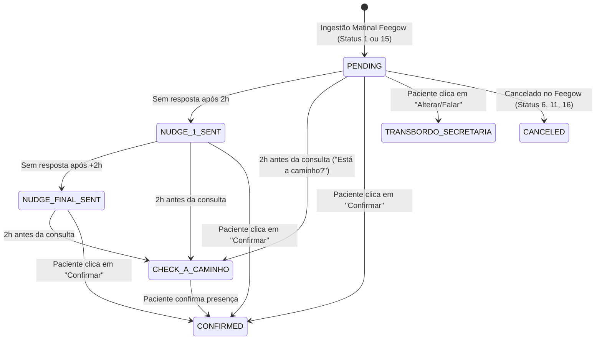
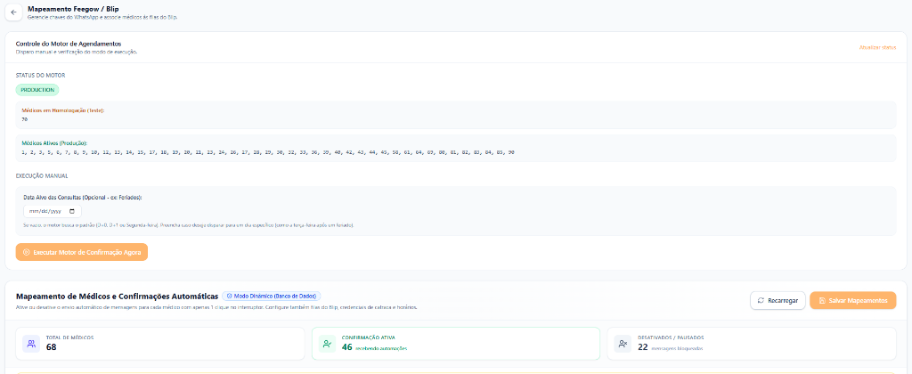
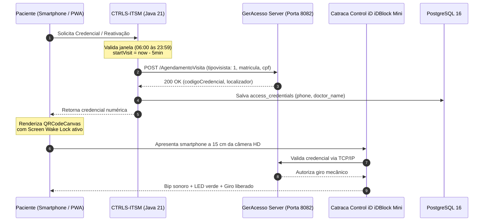
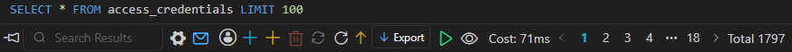
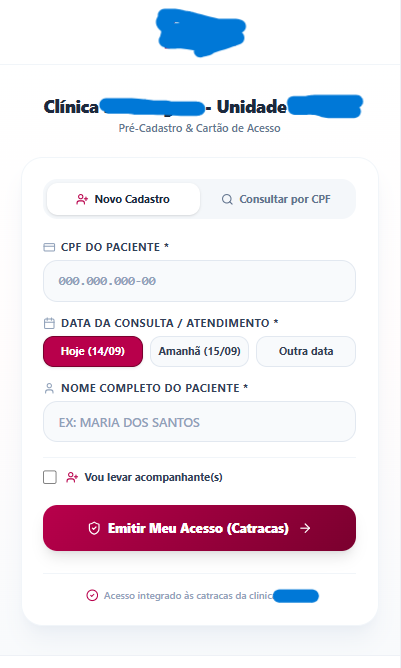
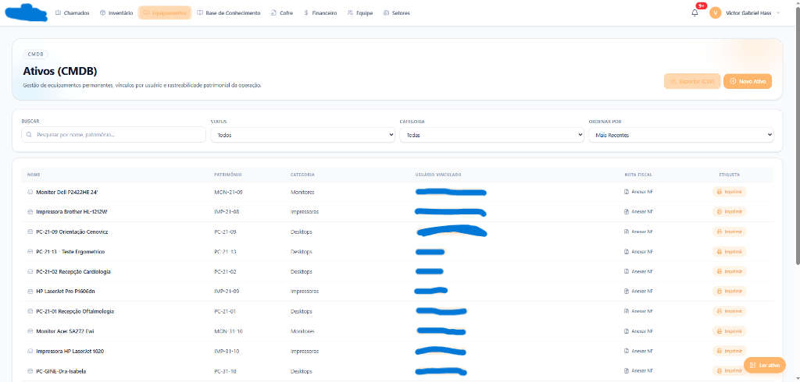
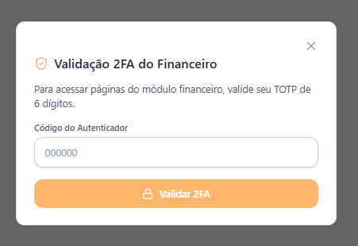
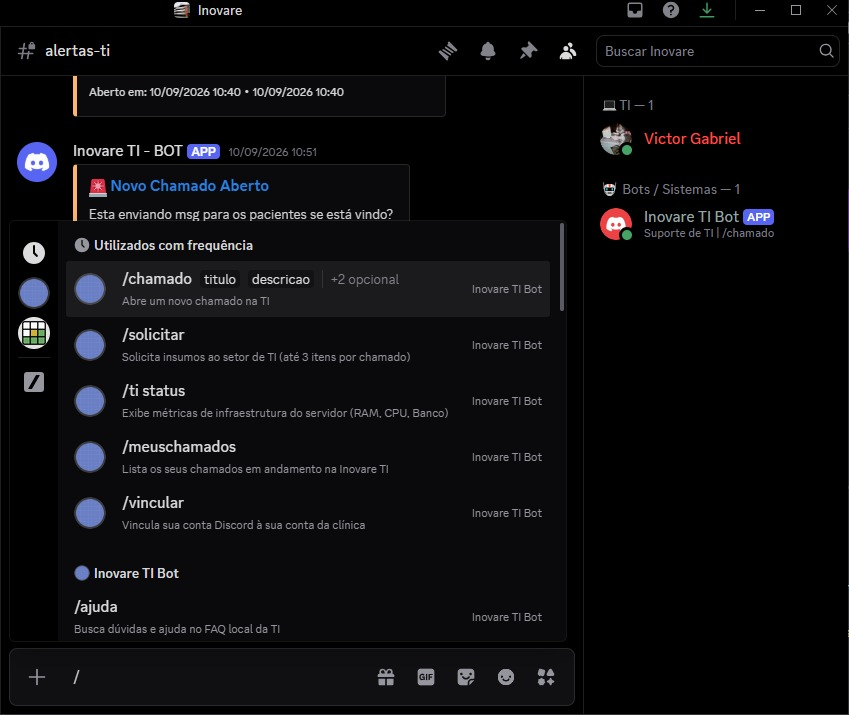
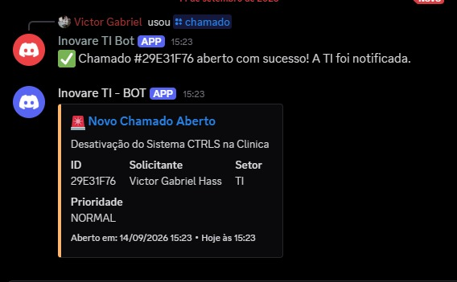
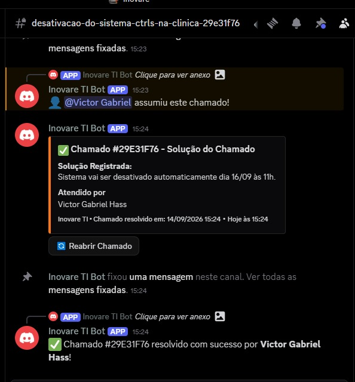

# Arquitetura e Implementação de um Ecossistema Hospitalar Integrado: ITSM, Automação Omnichannel, Conciliação Fiscal e Controle de Acesso IoT

**Documento:** Memorial Técnico-Descritivo, Relatório de Engenharia e Post-Mortem de Projeto  
**Autor:** Victor Gabriel Hass  
**Finalidade:** Trabalho de Conclusão de Curso (TCC) / Portfólio de Engenharia de Software  
**Período de Concepção e Desenvolvimento:** Agosto de 2024 a Setembro de 2026  
**Stack Principal:** Java 21 (Loom / Virtual Threads), Spring Boot 3 (Arquitetura Hexagonal), PostgreSQL 16, Redis, React 19, TypeScript, Vite, TailwindCSS, Docker, Take Blip (LIME Protocol), Feegow ERP API, Conta Azul V2 API, Control iD iDBlock Mini (GerAcesso), Discord JDA 5.  
**Situação Operacional:** Projeto concluído em nível de produção e descontinuado após encerramento do contrato de prestação de serviços por divergência estratégica quanto ao modelo de sustentação da plataforma.

---

## 1. Visão Geral e Pilares da Solução

Este memorial técnico documenta a concepção, o desenvolvimento em nível de produção e a conclusão do ecossistema hospitalar integrado **CTRLS-ITSM**, idealizado e desenvolvido por minha iniciativa direta como uma solução sob medida para automatizar de ponta a ponta os fluxos operacionais de uma policlínica médica de grande porte e de seu centro parceiro de diagnóstico por imagem (**Clínica da Imagem**).

A solução unificou 5 frentes críticas de operação médica e predial:
1. **Comunicação Omnichannel e Automação de Agendamentos:** Esteira inteligente conectando o WhatsApp (via Take Blip e Meta WhatsApp Cloud API) à grade médica do **Feegow ERP**, eliminando o trabalho braçal das secretárias, tratando as particularidades de cada agenda médica e reduzindo comprovadamente o absenteísmo (*no-show*), com **mais de 11 mil mensagens enviadas em 2 meses** e vazão de pico de **quase 500 mensagens diárias em menos de 1 minuto**.
2. **Controle de Acesso Físico IoT:** Integração direta com catracas eletrônicas **Control iD iDBlock Mini** e software de portaria **GerAcesso** na rede local, emitindo QR Codes dinâmicos em Progressive Web App (PWA) e eliminando as filas e cadastros manuais na recepção do térreo, com **mais de 1.800 credenciais de acesso geradas automaticamente em apenas 2 semanas** de operação nas catracas físicas.
3. **Marketing de Reputação:** Algoritmo automatizado de escuta pós-consulta que identifica pacientes atendidos no Feegow e despacha links de avaliação 5 estrelas no Google Meu Negócio, direcionando para a página individual do médico ou para a página institucional da clínica.
4. **Conciliação Financeira:** Automação de baixas de honorários e emissão de recibos médicos via **Conta Azul V2 API**.
5. **ITSM e Governança de TI:** Gestão de incidentes com cálculo de SLA em horas úteis, inventário patrimonial com baixa FIFO e bot operacional no Discord (JDA 5).

---

## 2. Histórico Evolutivo e Cronologia da Engenharia (2024 – 2026)

A construção do ecossistema resultou de uma maturação contínua de mais de dois anos de engenharia prática, dividida em marcos fundamentais:


### 2.1 Fase Embrionária (Agosto de 2024 a Dezembro de 2024 — Chesiquímica)
O embrião do módulo de suporte técnico iniciou em agosto de 2024 na indústria Chesiquímica. O objetivo era substituir formulários impressos por uma solução ágil de chamados de manutenção. Desenvolvi a primeira versão em JavaScript conectada a planilhas Google Docs por meio da API SheetMonkey. 

Buscando maior performance e controle de memória, realizei experimentos em linguagem C e posteriormente em PHP. Essa fase me permitiu mapear os requisitos essenciais de governança, ciclo de vida de chamados e controle de insumos.

### 2.2 Diagnóstico e Concepção na Clínica Inovare e Clínica da Imagem (Janeiro de 2025 a Novembro de 2025)
Ao assumir a liderança e infraestrutura tecnológica da Clínica Inovare (e sua operação integrada com a Clínica da Imagem) em janeiro de 2025, constatei a ausência de sistemas integrados de TI: computadores de consultório operavam sem inventário formal, filas de espera na recepção do térreo acumulavam dezenas de pacientes sem credencial predial e o índice de faltas em consultas médicas era alarmante.

Em março de 2025 desenvolvi um protótipo inicial para atendimento de chamados de TI. Paralelamente, através da observação atenta do cotidiano da clínica, identifiquei duas grandes fontes de ineficiência operacional humana:
1. As secretárias médicas passavam horas diárias ao telefone e trocando mensagens manuais individuais no WhatsApp para confirmar presenças;
2. As recepcionistas do térreo sofriam com sobrecarga severa, precisando atender ligações, responder mensagens no WhatsApp geral e realizar cadastros manuais de crachás físicos para as catracas.

Reestruturei o projeto a partir de agosto de 2025 com modelagem relacional rigorosa e planejamento da orquestração de mensagens via Take Blip e Feegow ERP.

### 2.3 Desenvolvimento e Implantação do Ecossistema Final (Março de 2026 a Setembro de 2026)
Em março de 2026 iniciei o repositório definitivo. Optei pela **Arquitetura Hexagonal (Ports & Adapters)** em **Java 21**, aproveitando o suporte nativo a **Virtual Threads (Project Loom)** para suportar centenas de requisições I/O concorrentes sem gargalos de thread pool. O frontend foi construído em **React 19 / TypeScript** com empacotamento otimizado via Vite.

Ao longo de 7 meses ininterruptos de trabalho, implementei **56 migrações Flyway**, 18 contextos delimitados desacoplados, a integração de hardware físico IoT com reuniões com a fabricante GerAcesso, trabalho presencial de UX no saguão da clínica e o algoritmo proprietário de reputação no Google.

---

## 3. Topologia Arquitetural e Visão dos Módulos

Arquitetei o backend sob princípios rígidos de isolamento de domínio corporativo, garantindo que mudanças em APIs externas (Feegow, Meta/Blip, Conta Azul ou GerAcesso) afetem estritamente a camada de adaptadores de infraestrutura (`infrastructure.adapter.output`), mantendo as regras de negócio (`domain`) e de aplicação (`application.usecase`) imutáveis e auditáveis:

```
br.dev.ctrls.itsm.modules/
├── access/         <-- Catracas físicas Control iD, QR Codes dinâmicos, PWA e acompanhantes
├── appointment/    <-- Ingestão Feegow, esteira de confirmações, nudges 2h e Google Review
├── finance/        <-- Conta Azul V2, conciliação de baixas e recibos OpenPDF
├── notification/   <-- Bot Discord JDA 5, Slash Commands e incidentes de TI
├── ticket/         <-- Central ITSM, cálculo de SLA em horas úteis e regra #🚨ParadaCrítica
├── asset/          <-- Inventário CMDB e rastreabilidade patrimonial
├── inventory/      <-- Estoque de insumos de informática e algoritmo FIFO
├── vault/          <-- Cofre criptográfico AES-256-GCM e autenticação TOTP/2FA
├── audit/          <-- Trilha de conformidade LGPD imutável com Correlation IDs
├── settings/       <-- Parâmetros do sistema e motor White-Label dinâmico (V56)
├── user/           <-- RBAC, hierarquia de setores e segurança
└── ...             <-- Módulos de apoio: auth, analytics, communication, etc.
```

---

## 4. Desafios Técnicos de Engenharia, Decisões e Soluções de Campo

### 4.1 Automação Omnichannel e Mensageria (Take Blip & Feegow ERP)

#### A Gênese do Sistema de Confirmações e o Contraste Comercial do Mercado:
O sistema de confirmações automáticas nasceu de uma iniciativa pessoal e proativa minha. Ao acompanhar a rotina dos consultórios, percebi claramente o desgaste das secretárias médicas: passavam a maior parte do expediente ligando individualmente para dezenas de pacientes e enviando mensagens manuais repetitivas para confirmar pautas do dia seguinte. Se uma secretária atendia dois ou três médicos de alta rotatividade, sua capacidade de prestar atendimento humanizado presencial aos pacientes nos consultórios era completamente sufocada.

Anteriormente, a clínica havia consultado a própria Take Blip para orçar um bot de confirmações. A cotação oficial apresentada pela empresa previa valores consideráveis para entregar um fluxo básico e padronizado:
* **R$ 18.000,00** de taxa inicial de implementação;
* **R$ 2.000,00 mensais** de manutenção e suporte;
* **R$ 15.000,00** adicionais cobrados ao término do desenvolvimento;
* **Totalizando R$ 33.000,00 a R$ 35.000,00 de investimento inicial**, mais mensalidade recorrente, para um robô que faria apenas confirmações genéricas, sem qualquer suporte a particularidades das agendas médicas.

Assumi o desafio e desenvolvi o ecossistema completo por um investimento inicial de apenas **R$ 2.800,00**, propondo posteriormente um modelo de sustentação técnica continuada por **R$ 80,00 mensais por médico ativo** — proposta que a governança da instituição, por contingenciamento orçamentário, optou por não acolher.

#### Mapeamento Detalhado de Peculiaridades Médicas:
Diferente da solução genérica orçada no mercado, passei **meses conversando diretamente com as secretárias**, mapeando as exceções de cada especialidade, ouvindo suas necessidades e compreendendo a estrutura de dados do Feegow. Programei regras de negócio altamente especializadas:

1. **Adiantamento Preventivo de Horário (10 Minutos):**
   * Determinados médicos enfrentavam atrasos sistemáticos porque pacientes chegavam exatamente no horário agendado (ou com pequenos atrasos), postergando toda a triagem e desregulando a pauta.
   * Desenvolvi uma lógica que adiantava em **10 minutos** o horário informado na mensagem de confirmação em relação ao horário registrado no Feegow (ex: consulta marcada às 14h00 no ERP era comunicada ao paciente como 13h50). Essa adequação fez com que o paciente estivesse presente e triado no minuto exato da consulta médica.
2. **Regra D+2 para Dermatologia e Procedimentos Especiais:**
   * Exames dermatológicos e biópsias exigiam preparo prévio e compra de medicações específicas, demandando confirmação com **2 dias de antecedência (D+2)**.
   * Implementei uma trava de calendário: as confirmações D+2 eram disparadas exclusivamente às **quartas-feiras** (para pautas de sexta) e às **quintas-feiras** (para pautas de sábado).
3. **Esteira Ativa de Nudges a Cada 2 Horas:**
   * Caso o paciente visualizasse a notificação e não respondesse, o motor (`MonitorAppointmentNudgesUseCase`) despachava lembretes automáticos de reforço (nudges) espaçados em **2 horas**, evitando que o agendamento ficasse esquecido.
4. **Mensagem Preventiva de Proximidade (2 Horas Antes da Consulta):**
   * Exatamente duas horas antes do horário do agendamento, o sistema enviava uma checagem amigável: *"Você já está a caminho da clínica?"*. Essa mensagem reduziu drasticamente as desistências de última hora e permitiu à recepção remanejar encaixes com antecedência.
5. **Resultado Concreto e Volumetria de Produção:**
   * O sistema **comprovadamente reduziu o número de faltas** na instituição, otimizando o aproveitamento dos consultórios e liberando as secretárias para o acolhimento presencial humanizado.
   * **Mais de 11.000 Mensagens em 2 Meses:** Durante os 2 meses de operação em produção, o sistema disparou com sucesso mais de 11 mil mensagens ativas de confirmação e acompanhamento aos pacientes.
   * **Vazão Extrema (< 1 Minuto para ~500 Mensagens):** Nas últimas semanas de operação, com a esteira totalmente madura, o sistema atingiu uma taxa de disparo de **quase 500 mensagens diárias despachadas em menos de 1 minuto**. Esse throughput expressivo foi viabilizado pela arquitetura assíncrona em **Java 21 com Virtual Threads (Project Loom)**, que eliminou qualquer bloqueio de thread de SO durante a comunicação I/O intensiva com as APIs do Take Blip e Feegow.




*Figura 1: Painel administrativo do motor de confirmações em produção: 68 médicos mapeados no Feegow ERP, 46 ativos recebendo automações, status do motor em tempo real e opção de disparo manual com data alvo.*


*Figura 2: Registro de auditoria no PostgreSQL: consulta à tabela `appointment_sessions` comprovando 10.280 sessões de confirmação processadas pelo motor.*

#### Desafios Críticos Superados no WhatsApp:
1. **Transbordo Dinâmico e Dual-Scope Sync no Blip Desk:**
   * *Problema:* Inicialmente, quando o paciente pedia para alterar a consulta ou falar com atendente, o bot enviava todas as mensagens para a fila geral do Desk, sobrecarregando uma única telefonista.
   * *Solução:* Programei o `BlipContactClientAdapter` para executar a sincronização em duplo escopo: enviando o comando LIME `/contacts` tanto para o Roteador Principal quanto para o Túnel do Desk, injetando os metadados `fila` e `Medico`. Assim, o atendimento caía instantaneamente na fila da secretária responsável por aquele médico (ex: *Ortopedia*, *Ginecologia*).
2. **O Erro #132000 da Meta em Templates de Grupo:**
   * *Problema:* Disparos de avisos agrupados para múltiplos agendamentos do mesmo paciente no dia (`aviso_agendamento_grupo`) falhavam na API da Meta com o erro `Validation failed (#132000)`.
   * *Solução:* A Meta proíbe o envio da chave `messageParams` quando o template não possui variáveis. Implementei no `BlipNotificationService` a detecção dinâmica de parâmetros, omitindo o nó JSON por completo quando nulo.
3. **Status Guard Contra Regressão:**
   * Agendamentos confirmados pelo paciente no WhatsApp recebem trava de imutabilidade local para impedir que sincronizações assíncronas do Feegow regredissem o status para não confirmado.

---

### 4.2 Controle de Acesso Físico IoT e Portaria Inteligente (Control iD / GerAcesso)

#### A Gênese do Sistema de QR Codes e Fim do Gargalo no Térreo:
Após estabilizar as confirmações no WhatsApp, voltei minha atenção para o saguão principal do edifício. As recepcionistas do térreo enfrentavam uma rotina de sobrecarga acentuada:
* O telefone da recepção tocava com alta frequência;
* Dezenas de mensagens chegavam simultaneamente no canal geral de atendimento;
* Formavam-se **filas expressivas de pacientes e acompanhantes** que precisavam aguardar no balcão apenas para apresentar um documento com foto, aguardar o cadastro manual no sistema de portaria e retirar um cartão/crachá plástico RFID para liberar a catraca física de entrada e saída.

Diante desse cenário, concebi a integração completa: se o paciente já confirmou a consulta no WhatsApp ou se realiza um auto-cadastro rápido no celular, a credencial predial é gerada automaticamente em formato de **QR Code digital**, permitindo a liberação autônoma e imediata na catraca física. Durante as **duas semanas de operação contínua nas catracas físicas**, o sistema gerou **mais de 1.800 credenciais de acesso automaticamente** para que pacientes e acompanhantes transitassem com agilidade pelo edifício, eliminando o tempo de espera no balcão da portaria.

#### Reuniões de Engenharia com a GerAcesso e Desenvolvimento de Campo:
* Participei diretamente de **reuniões técnicas de alinhamento com a equipe de engenharia e desenvolvimento da GerAcesso** (empresa responsável pelo software intermediário que gerenciava as catracas eletrônicas *Control iD iDBlock Mini* no condomínio).
* Analisei os contratos de rede TCP/IP, mapeei os endpoints REST (`/AgendamentoVisita`), identifiquei os limites de concorrência e compreendi as regras de anti-passback do hardware.
* Dediquei **meses de desenvolvimento e testes em bancada** na rede local (`172.25.100.106:8082`) até atingir a estabilidade necessária para levar a solução para a operação real.



#### Trabalho Presencial no Térreo e Refinamento de UI/UX nas Últimas Semanas:
Nas últimas duas semanas em que o sistema de QR Code entrou oficialmente em produção nas catracas físicas, **trabalhei presencialmente no saguão/térreo**, acompanhando de perto o comportamento real dos pacientes, recepcionistas e seguranças.

Essa vivência direta de campo me permitiu detectar pequenos atritos e implementar melhorias imediatas de engenharia e UI/UX:
1. **O Bug Tipográfico Mandatório do Fabricante (`tipovisista: 1`):**
   * A controladora física rejeitava requisições com o termo correto `tipoVisita`. Identifiquei via sniffing de rede que o firmware exigia rigorosamente a grafia incorreta `"tipovisista": 1` (commit `2aa38909`).
2. **Hesitação na Catraca e Reativação Imediata (Anti-Passback):**
   * Pacientes aproximavam o celular, a catraca bipava, mas se eles hesitassem antes de empurrar o braço mecânico, o leitor travava a credencial por anti-passback.
   * *Solução:* Criei o botão *"Atualizar / Reativar QR Code"* logo abaixo da imagem do código (`db58ec73`, `d62840f1`), disparando o `ReactivateAccessUseCase` com retroatividade de 5 minutos (`now.minusMinutes(5)`) para compensar dessincronizações de relógio (*clock skew*), gerando nova credencial em milissegundos sem recarregar a página.
3. **Ergonomia Ótica e Hardware Mobile:**
   * Pacientes encostavam o celular no vidro da lente: adicionei uma ilustração orientando a distância focal ideal de **15 cm**.
   * O Modo Escuro forçado de alguns celulares (Samsung Internet) invertia as cores do QR Code: forcei um container CSS com fundo branco puro.
   * A tela apagava por economia de energia na fila: implementei a **Screen Wake Lock API** para manter a tela no brilho máximo enquanto o código estivesse visível.
   * Preveni o auto-zoom indesejado do Safari no iPhone (`2da5307e`) e adicionei a funcionalidade de salvar o cartão diretamente como foto na galeria do celular (`332390fc`).
4. **Organização Visual em Abas para Acompanhantes:**
   * Para idosos ou crianças com múltiplos acompanhantes, criei abas claras na interface separando o titular de cada acompanhante (`dc428d99`, `4fe1eaed`), impedindo duplicidade de cadastros e permitindo o compartilhamento do QR Code de cada pessoa via WhatsApp.
5. **Impacto e Volumetria de Produção (1.800+ Credenciais Automáticas):**
   * Durante as **duas semanas de operação contínua nas catracas**, o sistema gerou **mais de 1.800 credenciais de acesso automaticamente** para que os pacientes e acompanhantes pudessem acessar o edifício de forma autônoma.
   * Essa automação eliminou a sobrecarga de triagem do térreo: a apresentação do QR Code direto na catraca reduziu o tempo de acesso ao prédio a meros segundos, sem necessidade de filas para conferência de documentos nem entrega de crachás físicos.


*Figura 3: Registro de auditoria no PostgreSQL: consulta à tabela `access_credentials` comprovando 1.797 credenciais digitais de acesso geradas e liberadas fisicamente nas catracas.*

---

### 4.3 Portais Autônomos de Acesso e Identidade Visual

Para atender à assimetria operacional do complexo de saúde, estruturei no módulo de acesso dois portais web autônomos e integrados:

#### 1. Portal das Consultas (`/acesso/:id`):
* Destinado aos pacientes dos consultórios da clínica geral e especialidades.
* Paleta visual em tons de **laranja** (`#FFA145`, `#E08328` e fundo suave `#FFD2A5`).
* Integrado à busca instantânea de agendamentos no Feegow por CPF e telefone.

#### 2. Portal da Clínica da Imagem (`/imagem`):
* A **Clínica da Imagem** (centro autônomo de diagnóstico por tomografia, ressonância, raio-X e ultrassonografia anexo ao prédio) não utilizava a grade do Feegow ERP nem o fluxo do robô de WhatsApp. Seus pacientes precisavam acessar o mesmo conjunto de catracas prediais.
* Construí o portal `/imagem` com a identidade visual autêntica da Clínica da Imagem: **paleta em tons de rosa / magenta / framboesa** (primária `#B8004B`, tom escuro `#7A002E`, fundos suaves `bg-rose-50` e badges `text-rose-800`).
* **Cache Offline Resiliente:** A função `saveCredentialsWithOfflineCache` gravava a credencial no `localStorage` do celular no momento do pré-cadastro feito em casa. No dia do exame, mesmo que o paciente estivesse sem internet na entrada do prédio, o QR Code abria instantaneamente sem efetuar requisições de rede.


*Figura 4: Interface web responsiva do totem de autoatendimento (Clínica da Imagem - Unidade Inovare), permitindo consulta de agendamento por CPF, seleção de datas e inclusão de acompanhantes.*


*Figura 5: Modal de cadastro rápido de acompanhante, gerando credenciais autorizadas vinculadas no mesmo fluxo.*


*Figura 6: Cartão digital de acesso gerado no smartphone do paciente com QR Code dinâmico, código de backup, orientações ergonômicas de leitura (15 cm), sala/consultório e botão para adicionar à agenda.*

---

### 4.4 Marketing de Reputação: Automação Inteligente do Google Meu Negócio

#### O Desafio da Reputação Pública:
A nota de avaliação pública da clínica no Google Meu Negócio encontrava-se em um patamar sensivelmente baixo: **3.3 estrelas**. As ações convencionais de comunicação e redes sociais anteriormente adotadas não haviam surtido efeito prático na conversão de avaliações espontâneas de pacientes atendidos.

#### A Solução Algorítmica Implementada:
Concebi e implementei uma esteira de escuta e captação ativa:
1. **Varredura Pós-Atendimento:** Periodicamente, o backend consultava a API do Feegow localizando consultas concluídas no dia com status `StatusID = 3` (*Atendido*).
2. **Encaminhamento Inteligente (Médico vs Clínica):**
   * Se o médico atendente possuía uma página própria e verificada no Google Meu Negócio (cadastrada em `doctor_configurations.google_review_url`), o robô enviava o link direcionado para a avaliação individual daquele profissional.
   * Caso o médico não possuísse página pessoal no Google, o sistema utilizava como fallback o link da **página institucional da clínica**.
3. **Solução para a Restrição de URL da Meta:** Como os botões interativos do WhatsApp impõem limites rígidos no comprimento de URLs dinâmicas, construí um endpoint encurtador interno com telemetria de cliques (`/v1/doctors/configurations/review/{hash}`), redirecionando o paciente diretamente para a tela de 5 estrelas do Google.
4. **Impacto Mensurável Comprovado:** Em **menos de 1 mês de funcionamento contínuo**, a nota média da clínica no Google Meu Negócio saltou de **3.3 para 3.8 estrelas**, gerando um fluxo contínuo de avaliações orgânicas positivas e fortalecendo a presença digital da instituição.

---

### 4.5 Conciliação Financeira (Conta Azul V2 API)
* **Gestão Concorrente de Tokens OAuth2:** Implementei a renovação preventiva de tokens a cada 50 minutos protegida por `ReentrantLock`, eliminando o erro de invalidação de sessão `invalid_grant`.
* **Motor de Contingência de Recibos em PDF (OpenPDF):** Diante de eventuais lentidões da API financeira para disponibilizar PDFs de quitação, construí um gerador em OpenPDF que montava e despachava recibos fiscais padronizados com os dados da baixa financeira diretamente para o e-mail do médico.
* **Rate Limiter com Redis:** Apliquei pacing de 350ms e limitador de taxa distribuído para respeitar as cotas da API financeira.

---

### 4.6 Governança de TI, ITSM e Operações (Discord Bot JDA 5 & PostgreSQL 16)
* **SLA Útil Hospitalar:** Algoritmo que calcula tempos de atendimento considerando rigorosamente o expediente útil comercial da clínica, pausando noites e finais de semana.
* **Regra de Parada Crítica (`#🚨ParadaCrítica`):** Falhas em consultórios médicos ou equipamentos críticos no CMDB (`assets.is_critical = true`) recebiam automaticamente prioridade máxima com meta de resolução em menos de **1 hora útil**.
* **Operação Integrada no Discord:** Bot interativo (JDA 5) com Slash Commands (`/ti status`, `/solicitar`) e botões nas mensagens para a equipe técnica aceitar ou encerrar chamados pelo smartphone sem precisar abrir o navegador.
* **Eliminação de Vazamentos HikariCP:** Desativação de *Open Session In View* (`spring.jpa.open-in-view=false`) para blindar o pool de conexões do PostgreSQL contra requisições lentas de APIs de terceiros.


*Figura 7: Dashboard executivo da Central de Chamados: 244 tickets totais atendidos, 235 resolvidos (taxa de resolução de 96,3%), controle de SLA e métricas por categorias.*


*Figura 8: Módulo de suprimentos e almoxarifado de TI com controle de saldo atual, alertas visuais de reposição e registro de novas entradas por lote.*


*Figura 9: Rastreabilidade patrimonial do CMDB: equipamentos de hardware vinculados a consultórios, setores e usuários responsáveis.*


*Figura 10: Camada de segurança e autenticação em dois fatores (TOTP de 6 dígitos) exigida para acesso ao módulo financeiro e relatórios confidenciais.*


*Figura 11: Módulo de agendamento automático de relatórios periódicos de estoque e chamados com despacho multicanal via E-mail e Discord.*

#### O Ciclo Completo de Atendimento via Discord Bot (JDA 5):
O bot do Discord foi desenvolvido não apenas como um canal de notificações passivas, mas como uma **central operacional completa e reativa para o atendimento técnico de campo**:
1. **Slash Commands Registrados:** O bot implementa comandos com auto-complete nativo (`/chamado`, `/solicitar`, `/ti status`, `/meuschamados`, `/vincular`, `/ajuda`), permitindo que colaboradores e técnicos realizem operações de TI pelo smartphone sem abrir o navegador.
2. **Despacho e Canal Dedicado por Chamado:** No momento em que um chamado é aberto, o bot cria automaticamente um canal de texto exclusivo para o ticket (ex: `#desativacao-do-sistema-ctrls-na-clinica-29e31f76`), calcula o prazo de SLA em horas úteis e despacha botões interativos (`Assumir Chamado`, `Resolver Chamado`).
3. **Atribuição, Solução e Reabertura:** Ao acionar *"Assumir Chamado"*, a mensagem é fixada, o técnico é atribuído no PostgreSQL e, na conclusão, o parecer técnico é registrado publicamente no Discord com confirmação auditável e botão para eventual reabertura.


*Figura 12: Automação ITSM via Discord (JDA 5): catálogo de Slash Commands registrados (`/chamado`, `/solicitar`, `/ti status`, `/meuschamados`, `/vincular`, `/ajuda`) com auto-complete nativo.*


*Figura 13: Notificação imediata de abertura de chamado via comando `/chamado`: geração de identificador hexadecimal (`#29E31F76`), metadados de solicitante e nível de prioridade.*


*Figura 14: Orquestração reativa do Discord Bot: criação automática de canal exclusivo para o chamado, cálculo de prazo de SLA em horas úteis e botões interativos (`Assumir Chamado`, `Resolver Chamado`).*


*Figura 15: Parecer técnico e resolução do chamado registrados no Discord e sincronizados instantaneamente com o banco relacional PostgreSQL, incluindo botão para eventual reabertura.*

---

## 5. Matriz de Entregas e Inventário Técnico do Sistema

A tabela abaixo resume as entregas técnicas consolidadas no código-fonte:

| Módulo | Componentes de Engenharia | Stack Tecnológica | Impacto Mensurado no Negócio |
|---|---|---|---|
| **Mensageria WhatsApp** | Ingestão Feegow D+0 a D+3, Dual-Scope Sync no Desk, Nudges a cada 2h, Mensagem preventiva de proximidade ("A caminho?"), Horários Adiantados (10 min), D+2 Dermatologia | Take Blip, LIME Protocol, Meta Cloud API, Feegow REST, Java 21 Loom | **Redução comprovada do absenteísmo (no-show)** e liberação das secretárias. **+11.000 mensagens enviadas em 2 meses**; vazão de pico de **quase 500 mensagens diárias em < 1 minuto**. |
| **Controle de Acesso IoT** | Catracas Control iD iDBlock Mini, GerAcesso REST, Reativação Imediata, Portais `/imagem` e `/acesso`, WakeLock | Java 21, Virtual Threads, React 19, LocalStorage, Screen Wake Lock | **Fim das filas no saguão do térreo**, liberação autônoma de pacientes e acompanhantes sem necessidade de crachá físico. **+1.800 credenciais prediais geradas automaticamente em 2 semanas**. |
| **Reputação Google** | Motor de pós-atendimento (Status 3), fallback Médico/Clínica, encurtador com telemetria | Spring Boot, Feegow API, Google My Business | **Elevação da nota do Google de 3.3 para 3.8 estrelas em menos de 1 mês**, resolvendo a inércia da comunicação tradicional. |
| **Identidade Clínica da Imagem** | Portal `/imagem`, tema rosa/magenta (`#B8004B`), cache offline de pré-cadastro | React 19, LocalStorage, CSS Variables | Atendimento autônomo aos pacientes de diagnóstico por imagem sem dependência do Feegow. |
| **Conciliação Financeira** | Sincronização Conta Azul V2, gerador de recibos OpenPDF, lock de concorrência OAuth2 | Conta Azul REST, OpenPDF, Redis Rate Limiter | Automação no despacho de recibos de quitação para e-mails dos médicos e rastreabilidade contábil. |
| **Central de Chamados (ITSM)** | SLA em horas úteis, Parada Crítica (1h), Bot Discord interativo com botões | Discord JDA 5, PostgreSQL 16, Spring Data JPA | Atendimento a incidentes em consultórios reduzido para menos de 60 minutos úteis. |
| **Estoque & Inventário** | Baixa transacional via algoritmo FIFO, rastreabilidade de compras e lotes | PostgreSQL 16, Propagation.MANDATORY | Auditoria exata do custo de insumos de informática alocados por setor e máquina. |
| **Cofre LGPD & Segurança** | Criptografia simétrica AES-256-GCM, MFA TOTP, Trilha imutável com Correlation ID | Java Cryptography Extension, Google Authenticator | Conformidade com a LGPD e proteção rigorosa de credenciais e senhas hospitalares. |
| **Arquitetura White-Label** | Configuração dinâmica de cores, logo e nomes via banco de dados (`system_settings`) e painel admin | Flyway V56, React Context, Tailwind CSS v4 | Generalização completa do sistema para implantação em qualquer clínica ou hospital sob marca própria. |

---

## 6. Considerações Finais, Encerramento e Propriedade Intelectual

O desenvolvimento do ecossistema **CTRLS-ITSM** representou um marco de engenharia de software aplicada à saúde, comprovando na prática como a união entre pesquisa de campo com os operadores (secretárias e recepcionistas), desenvolvimento de ponta (Java 21 com Virtual Threads e React 19) e integração de hardware físico IoT é capaz de erradicar ineficiências históricas de uma instituição hospitalar.

### O Desfecho Comercial e a Dinâmica de Sustentação:
O ciclo de implantação evidenciou um expressivo contraste de custo-benefício:
* A cotação de mercado obtida anteriormente pela clínica para um bot básico de mensageria situava-se entre **R$ 33.000,00 e R$ 35.000,00** de desenvolvimento, acrescidos de **R$ 2.000,00 mensais**, restrito apenas a confirmações padronizadas;
* Desenvolvi e homologuei em produção uma **plataforma hospitalar completa de 18 módulos** por um investimento inicial de desenvolvimento de apenas **R$ 2.800,00**;
* Para a sustentação técnica contínua e evolução das integrações, propus o valor de **R$ 80,00 mensais por médico atendido**, dimensionado de forma muito acessível frente ao ganho financeiro obtido com a recuperação de consultas que seriam perdidas por *no-show*.

Apesar dos expressivos ganhos operacionais mensurados — **mais de 11.000 mensagens de confirmação enviadas em 2 meses** (com picos de quase 500 mensagens diárias em menos de 1 minuto), **mais de 1.800 credenciais prediais geradas automaticamente em apenas 2 semanas de catracas**, redução comprovada de faltas e recuperação da nota pública no Google para 3.8 estrelas —, a instituição de saúde optou por não dar continuidade ao contrato nos moldes de licenciamento e suporte propostos, manifestando o desejo de absorver a tecnologia sem os custos recorrentes de manutenção técnica especializada.

Em consonância com as boas práticas de governança corporativa e diante do término da relação comercial, conduzi a desativação programada dos serviços nos servidores locais, realizando o arquivamento seguro e a expurgação de dados em conformidade com as diretrizes de privacidade.

### Declaração de Titularidade e Direitos Autorais:
Todo o código-fonte, arquitetura de software, esquemas de banco de dados e migrações Flyway (V1 a V56), rotinas de automação, integrações de hardware e documentações técnicas associadas constituem **obra intelectual, tecnológica e autoral única e exclusiva de Victor Gabriel Hass**.

O ecossistema encontra-se consolidado e pronto para:
1. **Trabalho de Conclusão de Curso (TCC):** Apresentação como memorial de engenharia de software e arquitetura hospitalar de alta disponibilidade.
2. **Portfólio Profissional:** Demonstração prática de liderança técnica, resolução de problemas complexos de hardware/software e geração de valor de negócio.
3. **Plataforma White-Label (CTRLS-ITSM):** Licenciamento e distribuição comercial independente como produto SaaS para outras redes, hospitais e clínicas médicas.
