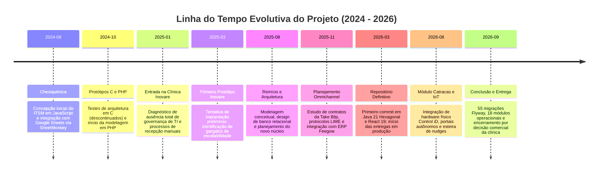
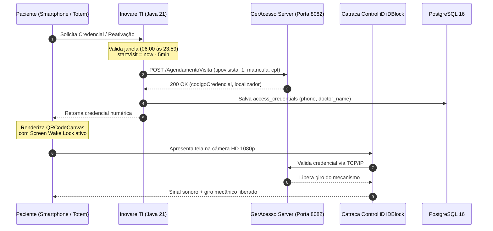

# Arquitetura e Implementação de um Ecossistema Hospitalar Integrado: ITSM, Automação Omnichannel, Conciliação Fiscal e Controle de Acesso IoT

**Documento:** Memorial Técnico-Descritivo, Relatório de Engenharia e Post-Mortem de Projeto  
**Autor:** Victor Gabriel Hass  
**Finalidade:** Trabalho de Conclusão de Curso (TCC) / Portfólio de Engenharia de Software  
**Período de Concepção e Desenvolvimento:** Agosto de 2024 a Setembro de 2026  
**Stack Principal:** Java 21 (Loom / Virtual Threads), Spring Boot 3 (Arquitetura Hexagonal), PostgreSQL 16, Redis, React 19, TypeScript, Vite, TailwindCSS, Docker, Take Blip (LIME Protocol), Feegow ERP API, Conta Azul V2 API, Control iD iDBlock Mini (GerAcesso), Discord JDA 5.  
**Situação Operacional:** Projeto concluído em nível de produção e descontinuado unilateralmente por recusa comercial de custeio por parte da instituição de saúde contratante.

---

## 1. Introdução e Contextualização do Projeto

O setor de saúde suplementar no Brasil enfrenta desafios críticos de interoperabilidade, absenteísmo de consultas (*no-show*), gargalos em recepções físicas e controle de ativos de tecnologia da informação. Sistemas hospitalares legados operam frequentemente em silos isolados, demandando intervenção humana manual para confirmar pautas médicas, liberar portarias e conciliar honorários profissionais.

O projeto **Inovare TI** foi concebido como uma plataforma de integração corporativa de alto desempenho destinada a automatizar de ponta a ponta os processos operacionais de uma policlínica médica de grande porte e de seu centro de diagnóstico anexo (**Inovare Imagem**).

A solução unificou:
1. **ITSM e Governança de TI:** Gestão de chamados com SLA útil, inventário patrimonial com baixa FIFO e orquestração operacional via Discord Bot (JDA 5).
2. **Comunicação Omnichannel:** Automação de WhatsApp via Take Blip e Meta WhatsApp Cloud API conectada em tempo real à grade do **Feegow ERP**.
3. **Controle de Acesso Físico IoT:** Integração direta com catracas eletrônicas **Control iD iDBlock Mini** e software de portaria **GerAcesso** na rede local, gerando credenciais QR Code dinâmicas em Progressive Web App (PWA).
4. **Conciliação Financeira:** Automação de baixas e envio de recibos de honorários médicos via **Conta Azul V2 API**.
5. **Marketing de Reputação:** Disparo inteligente de pesquisas pós-atendimento para elevação da nota no Google Meu Negócio.

---

## 2. Histórico Evolutivo e Cronologia da Engenharia (2024 – 2026)

A construção do ecossistema não se limitou a um ciclo de desenvolvimento pontual, mas resultou de uma maturação de mais de dois anos dividida em cinco marcos evolutivos:



### 2.1 Fase Embrionária (Agosto de 2024 a Dezembro de 2024 — Chesiquímica)
O embrião do módulo de suporte técnico iniciou em agosto de 2024 na indústria Chesiquímica. O objetivo original era substituir formulários físicos por uma solução ágil de chamados de manutenção. A primeira versão foi construída em JavaScript conectada a planilhas Google Docs por meio da API SheetMonkey. 

Buscando maior performance e controle de memória, foram realizados experimentos em linguagem C e posteriormente em PHP. Essa fase foi fundamental para mapear os requisitos essenciais de governança, ciclo de vida de chamados e controle de insumos.

### 2.2 Diagnóstico e Concepção na Clínica Inovare (Janeiro de 2025 a Novembro de 2025)
Ao assumir a infraestrutura tecnológica da Clínica Inovare em janeiro de 2025, constatou-se a ausência de sistemas padronizados de TI: computadores de consultório operavam sem inventário, filas de espera na recepção acumulavam pacientes sem credencial predial e o índice de faltas em consultas era elevado.

Em março de 2025 foi desenvolvido um protótipo inicial para atendimento de chamados. Diante das demandas específicas do ambiente médico (exigência de alta concorrência, conformidade LGPD e necessidade de diálogo com equipamentos de automação predial), o projeto foi reiniciado em agosto de 2025 com uma fase profunda de arquitetura de software, diagramação de processos e modelagem relacional. 

Em novembro de 2025, foi traçada a estratégia de automação de mensageria conectando a API do Feegow ERP à plataforma de conversação Take Blip.

### 2.3 Desenvolvimento e Implantação do Ecossistema Final (Março de 2026 a Setembro de 2026)
Em março de 2026 ocorreu o primeiro commit do repositório final. Optou-se pela **Arquitetura Hexagonal (Ports & Adapters)** em **Java 21**, aproveitando o suporte nativo a **Virtual Threads (Project Loom)** para suportar requisições I/O intensivas e concorrentes. O frontend foi construído em **React 19 / TypeScript** com empacotamento otimizado via Vite.

Ao longo de 7 meses de entregas ininterruptas, foram implementadas **55 migrações Flyway**, 18 módulos desacoplados e todas as integrações de hardware e APIs externas descritas a seguir.

---

## 3. Topologia Arquitetural e Visão dos Módulos

O backend foi arquitetado sob princípios de isolamento de domínio corporativo, garantindo que mudanças em APIs externas (Feegow, Meta, Conta Azul ou GerAcesso) afetem estritamente a camada de infraestrutura (`infrastructure.adapter.output`), mantendo o núcleo de regras de negócio (`domain`) e de aplicação (`application.usecase`) imutáveis.

```
br.dev.ctrls.inovareti.modules/
├── access/         <-- Catracas físicas Control iD, QR Codes, PWA e acompanhantes
├── appointment/    <-- Ingestão Feegow, nudges recorrentes, grupos e Google Review
├── finance/        <-- Conta Azul V2, conciliação de baixas e recibos OpenPDF
├── notification/   <-- Bot Discord JDA 5, Slash Commands e incidentes
├── ticket/         <-- Central ITSM, cálculo de SLA útil e regra #🚨ParadaCrítica
├── asset/          <-- Inventário CMDB e rastreabilidade de ativos
├── inventory/      <-- Estoque de insumos de TI e algoritmo FIFO
├── vault/          <-- Cofre criptográfico AES-256-GCM e autenticação TOTP/2FA
├── audit/          <-- Trilha de auditoria imutável (LGPD) com Trace IDs
├── user/           <-- RBAC, controle de acesso e hierarquia de setores
└── ...             <-- Módulos de suporte: auth, analytics, communication, etc.
```

---

## 4. Desafios Técnicos de Engenharia e Soluções Implementadas

### 4.1 Controle de Acesso Físico e Integração de Hardware IoT (Control iD iDBlock Mini / GerAcesso)

O maior desafio técnico de integração física do projeto residiu na liberação automática das catracas prediais a partir da confirmação do paciente no WhatsApp ou auto-cadastro.

#### Especificações de Engenharia do Equipamento:
* **Modelo:** Catraca Eletrônica **Control iD iDBlock Mini** (fornecida pela BrasilAcesso, operada pelo software intermediário GerAcesso).
* **Mecanismo:** Mecanismo silencioso com amortecimento hidráulico, dimensionado para durabilidade superior a **800.000 giros**.
* **Sensores Óticos e Câmeras:** Duas câmeras integradas HD 1080p (luz visível e luz infravermelha com detecção de rosto vivo) com capacidade de leitura de cartões MIFARE 13.56MHz e leitura ótica de **QR Code** via sensor iDFace.
* **Interface e Comunicação:** Display LCD TFT colorido de 4.3″ (480×272) resistivo; comunicação direta via **TCP/IP** e RS485 na rede local da clínica (`172.25.100.106:8082`).



#### Desafios Críticos Superados:

1. **O Bug de Protocolo do Fabricante (`tipovisista: 1`):**
   * *Diagnóstico:* O hardware recusava sumariamente as liberações de visitas. Testes com o nome correto de campo em português (`tipoVisita`) resultavam em resposta nula ou erro 500.
   * *Engenharia Reversa:* A análise do tráfego do servidor local da GerAcesso demonstrou que a controladora exigia rigorosamente o campo com o erro tipográfico original do fabricante: `"tipovisista": 1`. Se corrigido, a catraca não liberava.
   * *Solução:* O modelo canônico Java (`GerAcessoRequest`) foi serializado com anotação explícita `@JsonProperty("tipovisista")` forçando o valor inteiro `1`.

2. **Bloqueio por Anti-Passback e Hesitação Mecânica:**
   * *Diagnóstico:* Se o paciente aproximava o smartphone da câmera da catraca, a catraca autorizava, mas caso o paciente hesitasse ou conversasse na portaria antes de empurrar o braço mecânico, o timeout expirava. Em uma segunda tentativa, a controladora acusava bloqueio por *Anti-Passback* (registro de entrada sem saída).
   * *Solução:* Criação do caso de uso `ReactivateAccessUseCase` e do botão *"Atualizar / Reativar QR Code"*:
     * O backend gera uma nova solicitação na controladora física com janela imediata e retroatividade de 5 minutos (`now.minusMinutes(5)`) para compensar dessincronizações de relógio (*clock skew*) entre a VM da API e a controladora física.
     * Uma nova credencial numérica é emitida na hora e substituída no banco de dados e na interface do paciente sem reload.

3. **Fatores Físicos e Óticos na Leitura de Smartphones:**
   * *Diagnóstico:* Pacientes enfrentavam dificuldades ao apontar o celular para a câmera da catraca devido a 4 fatores de hardware:
     1. Navegadores com **Modo Escuro Forçado** (Samsung Internet / Dark Mode nativo) invertiam a renderização do `<canvas>`, exibindo QR Code branco em fundo preto, o qual a câmera infravermelha não reconhecia.
     2. Pacientes colavam o celular encostado no vidro da catraca, fora do campo focal da lente da câmera.
     3. A tela do smartphone apagava por economia de energia na fila da recepção.
     4. O elemento `<canvas>` do React sofria travamento de renderização em navegadores WebKit/Android ao trocar de código.
   * *Soluções:*
     * Container com fundo branco forçado em CSS inibindo inversão por navegadores móveis.
     * Guia visual e animação instrutiva orientando a distância ideal de **15 cm** da lente.
     * Implementação da **Screen Wake Lock API** do navegador para travar a tela acesa no brilho máximo enquanto o QR Code estivesse aberto.
     * Forçamento de remontagem do elemento React com chaves dinâmicas (`key={cred.credentialCode}`).

4. **Assimetria Setorial e Portais Autônomos (`/imagem` e `/inovare`):**
   * *Diagnóstico:* O centro de diagnóstico **Inovare Imagem** não utilizava o Feegow ERP nem o robô do Blip. Seus pacientes necessitavam de acesso às catracas físicas sem que houvesse uma consulta prévia na grade. Da mesma forma, certos setores da clínica usavam o Feegow mas não o Blip.
   * *Solução:* Desenvolvimento de portais dedicados:
     * **`itsm-inovare.ctrls.dev.br/imagem`**: Portal temático com identidade visual em tons de azul e roxo da Clínica da Imagem para auto-cadastro de pacientes e acompanhantes.
     * **`itsm-inovare.ctrls.dev.br/inovare`**: Portal com a paleta oficial em tons de laranja (`#ffa145` e `#ffd2a5`) para pacientes de setores sem WhatsApp. As recepcionistas enviavam o link, o paciente informava o CPF e o sistema efetuava a busca instantânea de agendamentos no Feegow.
   * *Estratégia de Cache e LocalStorage:* Como a Clínica da Imagem não persistia agendamentos no Feegow, foi arquitetada a função `saveCredentialsWithOfflineCache`: a credencial emitida no pré-cadastro na véspera ficava gravada no `localStorage` do celular. No dia do exame, ao abrir o navegador na portaria, o QR Code abria instantaneamente sem requisição de rede. Caso o navegador tivesse limpado o cache, a tela continha o recurso *"Buscar Cadastro"*, que via CPF buscava os dados diretamente no PostgreSQL da aplicação.

5. **Cadastro Concorrente de Acompanhantes (Java 21 Virtual Threads):**
   * Pacientes idosos ou menores de idade frequentemente compareciam com 1 a 3 acompanhantes. O backend despachava os cadastros de cada acompanhante para a GerAcesso em paralelo via Virtual Threads (`Executors.newVirtualThreadPerTaskExecutor()`). Falhas isoladas em acompanhantes não bloqueavam o titular.

---

### 4.2 Automação Omnichannel e Mensageria (Take Blip & Feegow ERP)

A esteira de confirmações automatizou a comunicação com milhares de pacientes mensais no WhatsApp.

#### Desafios Críticos Superados:

1. **Correção do Roteamento de Fila no Blip Desk (Desafio de Transbordo):**
   * *Diagnóstico:* Quando o paciente clicava nos botões interativos para *"Confirmar Presença"* ou *"Solicitar Alteração"*, o bot falhava em encaminhar o atendimento para a equipe médica responsável (ex: secretárias de Ortopedia, Oftalmologia ou Ginecologia). Todas as interações caíam indiscriminadamente na **fila padrão (default)** do Blip Desk, sobrecarregando uma única atendente.
   * *Solução:* O `BlipContextService` foi projetado para:
     * Resolver dinamicamente a fila do profissional a partir do cadastro em `doctor_configurations.blip_queue_id` e `blip_queue_name`.
     * Injetar a variável de contexto `attendanceQueueToRedirect` diretamente no contato via comando LIME `/contexts`.
     * Executar a sincronização em duplo escopo (**Dual-Scope Sync**) enviando o comando LIME `/contacts` de forma síncrona tanto para o Roteador Principal quanto para o Túnel do Blip Desk, garantindo que a secretária recebesse o atendimento já na sua aba de especialidade com nome do médico, fila e CPF preenchidos.

2. **Esteira de Nudges Recorrentes e Combate ao Absenteísmo (*No-Show*):**
   * *Diagnóstico:* Grande parte dos pacientes visualizava a primeira mensagem de agendamento e não respondia, resultando em faltas não comunicadas e ociosidade da agenda médica.
   * *Solução:* Desenvolvimento do `MonitorAppointmentNudgesUseCase`:
     * Disparo de **Nudges automáticos a cada 2 horas** solicitando a confirmação do paciente.
     * Envio de mensagem preventiva de proximidade **("Você está a caminho?") 2 horas antes do horário marcado**.
     * *Resultado:* Redução drástica e comprovada no absenteísmo da clínica, permitindo que a recepção remanejasse horários vagos com antecedência.

3. **O Erro #132000 da Meta em Templates Estáticos:**
   * *Diagnóstico:* Disparos de templates consolidados de grupo (ex: `aviso_agendamento_grupo`) eram rejeitados pela Meta com erro `Validation failed (#132000)`.
   * *Solução:* A Meta proíbe o envio do array `messageParams` em templates sem variáveis. O `BlipNotificationService` passou a auditar dinamicamente a presença de placeholders, omitindo 100% o campo quando desnecessário.

4. **O "Status Guard" contra Regressão de Status no Feegow ERP:**
   * *Diagnóstico:* Se o paciente confirmava a consulta no WhatsApp às 08h00, mas a ingestão matinal seguinte rodasse antes da réplica de banco do Feegow consolidar a alteração, a rotina corria o risco de sobrescrever a consulta como `PENDING` ou cancelada.
   * *Solução:* Implementação do `Status Guard`: agendamentos confirmados localmente recebem status imutável perante a esteira de busca geral, exigindo consulta individual na API antes de qualquer transição destrutiva.

5. **Eliminação de Virtual Thread Pinning no Java 21 Loom:**
   * *Diagnóstico:* Quedas de performance sob alta concorrência de mensagens.
   * *Solução:* Identificação e expurgo de blocos `synchronized` legados em clientes de rede socket, os quais causavam o bloqueio dos threads do sistema operacional associados às Virtual Threads (*thread pinning*).

---

### 4.3 Marketing de Reputação: Automação do Google Meu Negócio

Um dos maiores legados de impacto financeiro direto para a instituição foi a automação de captação de avaliações 5 estrelas no Google.

#### Arquitetura e Solução de Contorno:
1. **Varredura Pós-Atendimento:** A cada 30 minutos, um job no backend consultava a API do Feegow buscando pacientes cujo status foi alterado para `StatusID = 3` (*Atendido*).
2. **Desafio de Restrição de URL da Meta/Blip:** Os botões interativos de templates do WhatsApp impõem limites severos de caracteres em parâmetros de URL, impedindo o envio de URLs longas de avaliação do Google Meu Negócio.
3. **Solução do Redirecionador Inteligente:** O desenvolvedor criou um endpoint interno encurtado na própria API (`/v1/doctors/configurations/review/{hash}` ou link parametrizado por médico).
   * O paciente recebia uma mensagem personalizada com um botão amigável no WhatsApp.
   * Ao clicar, a API Inovare registrava a telemetria do clique e redirecionava imediatamente o navegador do paciente para a tela de avaliação de 5 estrelas do profissional específico no Google Meu Negócio.
4. **Impacto Mensurável Comprovado:** Em apenas **30 dias de operação contínua**, a nota média de avaliação da Clínica Inovare no Google saltou de **3.3 para 3.8 estrelas**, revertendo avaliações negativas históricas e gerando atração orgânica de novos pacientes particulares.

---

### 4.4 Automação e Conciliação Fiscal (Conta Azul V2)

A integração financeira visou a emissão e o envio automatizado de recibos de honorários médicos para os e-mails pessoais/contábeis dos profissionais credenciados.

* **Concorrência de Tokens OAuth2:** Implementação de renovação proativa a cada 50 minutos protegida por `ReentrantLock` para evitar que disparos simultâneos gerassem o erro fatal `invalid_grant`.
* **Emissão de Recibos em PDF de Contingência (OpenPDF):** Como a API Conta Azul frequentemente falhava ou demorava para disponibilizar o PDF da baixa financeira, foi construído um motor interno em OpenPDF que gerava recibos fiscais corporativos com cabeçalho, CNPJ e dados de quitação da clínica.
* **Controle de Vazão (Rate Limiting):** Adoção de pacing de 350ms entre requisições e rate limiter distribuído em Redis para respeitar as cotas da API financeira.

---

### 4.5 Governança de TI, ITSM e Operações (Discord Bot JDA 5 & PostgreSQL 16)

Embora tenha apresentado alta estabilidade operacional devido ao design não-bloqueante, o módulo de ITSM representou o centro nervoso da equipe de suporte:

* **SLA Útil Dinâmico:** Algoritmo que calcula prazos de resolução considerando estritamente o horário de expediente comercial da clínica, pausando a contagem em noites e finais de semana.
* **Regra de Parada Crítica (`#🚨ParadaCrítica`):** Identificação de falhas em consultórios médicos ou ativos marcados como críticos no CMDB (`assets.is_critical = true`), forçando reclassificação para prioridade `URGENT` e SLA limite de **1 hora útil**.
* **Operação Integrada via Discord:** Bot nativo (JDA 5) com Slash Commands (`/ti status`, `/solicitar`) e botões interativos nas mensagens para técnicos assumirem ou rejeitarem chamados sem abrir o navegador.
* **Resolução de Vazamentos HikariCP (OSIV):** Desativação do padrão *Open Session In View* (`spring.jpa.open-in-view=false`) para evitar que conexões JDBC ficassem retidas durante requisições de rede externas, eliminando travamentos de banco.

---

## 5. Matriz de Entregas e Inventário do Sistema

A tabela a seguir consolida as entregas técnicas verificadas no código-fonte:

| Módulo | Componentes de Engenharia | Tecnologias Envolvidas | Impacto no Negócio |
|---|---|---|---|
| **Controle de Acesso IoT** | Catracas Control iD iDBlock Mini, GerAcesso REST, Reativação Imediata, Portais `/imagem` e `/inovare` | Java 21, Virtual Threads, React 19, LocalStorage, WakeLock | Eliminação de filas na portaria, liberação de acompanhantes em paralelo e acesso 100% funcional offline. |
| **Mensageria WhatsApp** | Ingestão Feegow D+0 a D+3, Dual-Scope Sync, Nudges 2h, Lembretes de Proximidade | Take Blip, LIME Protocol, Meta Cloud API, Feegow REST | Redução drástica no no-show de consultas e roteamento exato para as secretárias por especialidade. |
| **Reputação Google** | Engine de pós-consulta (Status 3), encurtador de URLs com telemetria de cliques | Spring Web, Feegow API, Google My Business | Elevação da pontuação institucional da clínica no Google de **3.3 para 3.8 estrelas em 30 dias**. |
| **Conciliação Fiscal** | Sincronização Conta Azul V2, gerador de recibos OpenPDF, lock de OAuth2 | Conta Azul REST, OpenPDF, Redis Rate Limiter | Envio tempestivo de recibos fiscais para e-mails dos médicos e rastreabilidade contábil. |
| **Central de Chamados (ITSM)** | SLA em horas úteis, Parada Crítica (1h), Bot Discord interativo | JDA 5 (Discord), PostgreSQL 16, Spring Data JPA | Tempo de resposta para panes em consultórios reduzido para menos de 60 minutos. |
| **Inventário & Estoque** | Baixa transacional via algoritmo FIFO, rastreamento de lotes e compra | PostgreSQL 16, Propagation.MANDATORY | Auditoria precisa do custo de insumos de informática aplicados a cada máquina e setor. |
| **Cofre LGPD & Segurança** | Criptografia simétrica AES-256-GCM, MFA TOTP, Trilha imutável | Java Cryptography Extension, Google Authenticator | Conformidade integral com a LGPD e blindagem contra vazamento de credenciais hospitalares. |

---

## 6. Considerações Finais e Propriedade Intelectual

O desenvolvimento do ecossistema **Inovare TI** consolidou uma arquitetura hospitalar moderna, resiliente e de alta disponibilidade, superando restrições de hardware IoT, particularidades de protocolos de terceiros e exigências clínicas dinâmicas.

Apesar da excelência técnica comprovada e do impacto direto gerado nas operações e na reputação pública da clínica (aumento mensurado de presença e elevação de notas no Google), a instituição de saúde recusou o custeio comercial da solução — rejeitando até mesmo uma proposta de remuneração módica de **R$ 80,00 mensais por médico atendido** —, optando por exigir a disponibilização gratuita de todo o ecossistema.

Diante da quebra de confiança e da recusa contratual, o projeto foi formalmente descontinuado nas dependências da contratante, com a execução dos runbooks de desativação segura e expurgo de dados.

### Declaração de Titularidade Intelectual:
Todo o código-fonte, esquemas de migração Flyway (V1 a V55), diagramas conceituais, heurísticas de automação e documentações técnicas associadas ao presente projeto constituem **obra tecnológica de autoria e propriedade intelectual única e exclusiva de Victor Gabriel Hass**. 

O projeto encontra-se integralmente preservado e apto para:
1. Apresentação como **Trabalho de Conclusão de Curso (TCC)** e memorial de engenharia de software em nível acadêmico de graduação.
2. Composição de **Portfólio Profissional de Engenharia de Software Sênior**.
3. Empacotamento, distribuição e licenciamento comercial sob modelo de **Software as a Service (SaaS) White-Label** para outras redes e cooperativas de saúde.
